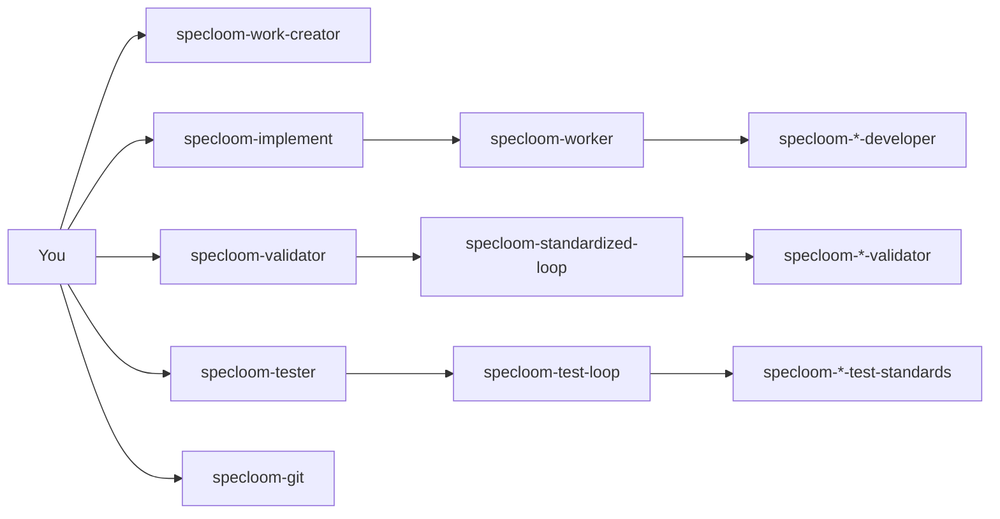

# SpecLoom

**Weave ideas into shipped code.**

SpecLoom is an installable spec-driven workflow for [Cursor](https://cursor.com), [OpenAI Codex](https://openai.com/codex), and [Google Antigravity](https://antigravity.google/). It turns a codebase into a **spec loom**: ideas become features, features become dated specs, specs become validated implementation, and completed work merges back to a stable integration branch — with human sign-off at the draft stage and automation everywhere else.

You invoke **five peer orchestrators** independently — they **never** call each other:

`@specloom-work-creator` · `@specloom-implement` · `@specloom-validator` · `@specloom-tester` · `@specloom-git`

Chain them manually in that order for a full pipeline.

---

## Table of contents

- [Why use SpecLoom?](#why-use-specloom)
- [When to use it](#when-to-use-it)
- [When not to use it](#when-not-to-use-it)
- [How it works](#how-it-works)
- [Prerequisites](#prerequisites)
- [Installation](#installation)
- [Bootstrap a repository](#bootstrap-a-repository)
- [Daily usage](#daily-usage)
- [Automations (hands-off runs)](#automations-hands-off-runs)
- [Git workflow](#git-workflow)
- [Agent team](#agent-team)
- [Validation gates](#validation-gates)
- [Testing standards](#testing-standards)
- [Troubleshooting](#troubleshooting)
- [Project structure](#project-structure)
- [Contributing](#contributing)

---

## Why use SpecLoom?

Most AI coding sessions are **one-shot**: you ask, the model edits, you review, repeat. That works for small fixes but breaks down on multi-week features because:

| Problem | SpecLoom answer |
|--------|------------------|
| Context evaporates between sessions | Specs + work-records + `docs/` are durable source of truth |
| No quality bar | Three validation gates (draft, work, test) with ≥99% confidence threshold |
| Agents improvise architecture | Features define *what*; specs define *how* with tasks and file paths |
| Git chaos | All AI work branches from `ai-workflow`, merges via PR, branch deleted after |
| You become the coordinator | Workflow coordinator runs priority: tasks → features → ideas → idle |
| Retry loops never end | **Rule of 3** — three failed attempts → `blocked_work.json`, session stops |

SpecLoom is opinionated on purpose. The opinions are what make long-running AI engineering predictable.

### What you get

- **20+ specialized specloom agents** (specloom-implement, coordinator, technical writer, QA, frontend/backend/database devs, records keeper, release engineer, system advisor)
- **35+ skills** encoding loop procedures, validation rubrics, and coding standards
- **Repo scaffolding** — `docs/` tree, automation state, work-record templates, GitHub planning config
- **Loop engineering** — coordinator, spec creation, task execution, validation, review loops
- **Triple runtime** — Cursor (`.cursor/`), Codex (`.codex/` + `.agents/skills/`), Antigravity (`~/.gemini/config/skills/` + global workflows)

---

## When to use it

Use SpecLoom when your project has **most** of these traits:

1. **Multi-step features** — work spans days or weeks, not a single chat
2. **You want specs before code** — dated spec files with explicit tasks beat ad-hoc prompts
3. **Quality matters** — you need lint, tests, and coverage gates, not just "it compiles"
4. **GitHub issue tracking** — ideas and features live as labeled issues (`sdd:idea`, `sdd:feature`)
5. **Repeatable automation** — Cursor Automations or Codex scheduled runs on `ai-workflow`
6. **A team-shaped workflow** — you want roles (writer, QA, dev) even if one human reviews

**Good fits:** product apps, internal tools, greenfield MVPs, refactors with clear acceptance criteria.

**Also good:** repos where you already use `AGENTS.md` and want a structured upgrade path.

---

## When not to use it

Skip SpecLoom if:

- You need a **single quick fix** — overhead of specs/issues won't pay off
- The project has **no tests** and you don't plan to add them (test gate will block constantly)
- You can't use **GitHub Issues** or `gh` CLI for planning
- You want **full manual control** of every file edit with no automation
- The codebase is a **throwaway prototype** you'll discard in a day

SpecLoom optimizes for **sustained engineering**, not spike hacks.

---

## How it works

### Four planning layers

```
Phase (docs/phases/)  →  Idea  →  Feature  →  Spec (docs/specs/)
  01-Prototype            optional   WHAT        HOW
```

| Layer | Where | Purpose |
|-------|-------|---------|
| **Phase** | `docs/phases/NN-Name/PHASE.md` | Core product focus — in/out of scope for this stage |
| **Idea** | GitHub issue `sdd:idea` + `sdd:status:backlog` | Raw problem or opportunity |
| **Feature** | GitHub issue `sdd:feature` + `phase:` frontmatter | What to build within active phase |
| **Spec** | `docs/specs/MMDDYY_slug.md` | How to build one unit of work |

`active_work.json` → **`activeProductPhase`** tracks the current phase. Validators and testers score **phase alignment** alongside spec/feature criteria. When all phase features are archived, the phase moves to `docs/phases/archived/` like features and specs.

### Coordinator priority (automation)

The workflow coordinator always prefers **finishing in-flight work** over starting new ideas:

```
1. Ready tasks on Pending specs     → task execution
2. Ready features (spec queue row)  → spec creation
3. Backlog ideas                    → feature definition
4. Idle                             → stop
```

### Gate sequence (user pipeline)

```
@specloom-work-creator   → planning + sign-off
@specloom-implement      → worker loop (≤10) + worker-validation
@specloom-tester         → test loop (≤5)
@specloom-validator      → final validation (impl + tests) + sign-off
```

Each step is a **separate chat invocation**. No orchestrator auto-chains the next.

Git bookends run inside each orchestrator session (or invoke `@specloom-git` standalone).

### Architecture



**Critical rule:** Five peer orchestrators speak to you in natural language. Sub-agents return JSON only. **Peers never Task-delegate each other.**

---

## Prerequisites

| Requirement | Why |
|-------------|-----|
| **Node.js 18+** | Runs the installer (`install.mjs`) |
| **Cursor** and/or **Codex** and/or **Antigravity** | Host environment for agents/skills/workflows |
| **Git** | Branch workflow, PRs |
| **[GitHub CLI](https://cli.github.com/)** (`gh`) | Idea/feature issues, planning queries |
| **A GitHub repo** | Planning issues + `ai-workflow` branch |

Optional but recommended:

- Cursor **Automations** or Codex **scheduled automations** for hands-off runs
- Existing test suite with **unit**, **integration**, **system**, and **performance** commands in `AGENTS.md`

---

## Installation

### 1. Clone the repository

```bash
git clone https://github.com/AIHeart-Professional/specloom.git
cd specloom
```

### 2. Run the installer

**All platforms (recommended):**

```bash
node scripts/install.mjs --all
```

**Windows (PowerShell):**

```powershell
.\install.ps1 --all
```

**macOS / Linux:**

```bash
chmod +x install.sh
./install.sh --all
```

### Install options

| Flag | Effect |
|------|--------|
| `--cursor` | Install Cursor agents → `~/.cursor/agents/`, skills → `~/.cursor/skills/` |
| `--codex` | Install Codex agents → `~/.codex/agents/`, skills → `~/.agents/skills/` |
| `--antigravity` | Install Antigravity skills → `~/.gemini/config/skills/`, workflows → `~/.gemini/antigravity/global_workflows/` |
| `--all` | Cursor + Codex + Antigravity (default) |
| `--force` | Overwrite existing files (creates timestamped `.specloom-backup-*` first) |
| `--dry-run` | Print actions without writing |
| `--bootstrap <path>` | Scaffold `docs/` in target repo (see below) |

**Examples:**

```bash
# Cursor only
node scripts/install.mjs --cursor

# Codex only, preview changes
node scripts/install.mjs --codex --dry-run

# Antigravity only
node scripts/install.mjs --antigravity

# Install + bootstrap new app in one step
node scripts/install.mjs --all --bootstrap ~/Projects/my-app
```

### 3. Verify installation

**Cursor:** Open Agent panel → you should see `specloom-implement` as a subagent.

**Codex:** Custom agents list should include `specloom-implement`.

**Antigravity:** Type `/specloom` in agent chat — you should see `/specloom-implement`, `/specloom-validator`, etc. Skills live in `~/.gemini/config/skills/specloom-orchestrator-session/`.

**Skills:** Check `~/.cursor/skills/specloom-worker-loops/` (Cursor) or `~/.agents/skills/specloom-orchestrator-session/` (Codex).

### 4. Update later

Pull latest `specloom` and re-run with `--force`:

```bash
git pull
node scripts/install.mjs --all --force
```

---

## Bootstrap a repository

SpecLoom needs a `docs/` command center in each project repo. Bootstrap creates the full tree:

```bash
node scripts/install.mjs --bootstrap /path/to/your-repo
```

Or combine with global install:

```bash
node scripts/install.mjs --all --bootstrap ./my-app
```

### What gets created

```
your-repo/
├── AGENTS.md                          # Build/test commands (edit this!)
├── docs/
│   ├── README.md                      # Command center index
│   ├── specs/                         # Dated specs
│   ├── specs/work-records/            # Manifest + completion templates
│   ├── automation/
│   │   ├── loops/                     # 6 loop procedure files
│   │   ├── state/                     # active_work.json, blocked_work.json
│   │   ├── reports/                   # daily_summary, validation reports
│   │   └── github-planning.json       # GitHub repo + label config
│   ├── architecture/                  # System stubs
│   ├── decisions/                     # Durable Q&A tables
│   ├── knowledge/                     # Product/implementation memory
│   └── workflows/                     # Automation + orchestration notes
├── automation_inputs/                 # Local only (gitignored)
├── automation_outputs/                # Local only (gitignored)
└── local_data/                        # Local only (gitignored)
```

### Post-bootstrap checklist

1. **Edit `AGENTS.md`** — add your build, lint, typecheck, unit, integration, and E2E commands
2. **Edit `docs/automation/github-planning.json`** — set your `owner/repo` and label names
3. **Create `ai-workflow` branch** on GitHub:
   ```bash
   git checkout -b ai-workflow
   git push -u origin ai-workflow
   ```
4. **Authenticate GitHub CLI:** `gh auth login`
5. **Commit the docs tree** before enabling automations

---

## Daily usage

### Entry point

| Platform | Talk to | Example prompt |
|----------|---------|----------------|
| **Cursor** | `@specloom-implement` | "Run the coordinator until idle." |
| **Codex** | `specloom-implement` | "What's the next SDD task on this repo?" |
| **Antigravity** | `/specloom-implement` | "Run implementation on the active spec." |

### Common workflows

#### Sign off a feature or spec draft

After the team creates and validates a draft, you'll see something like:

```markdown
## Spec ready for your review — 062626_auth-filter

### What this will do
Adds JWT filter middleware and wires login flow to existing session store.

### Estimated tokens
~18,000 total (T1: 6k, T2: 8k, T3: 4k)

### Open questions
1. Use refresh tokens or session-only? — _default: session-only_

### Your move
Reply **approved** to promote and start implementation.
```

- **Sign off:** `approved`, `sign off`, `proceed`, `lgtm`, `go ahead`
- **Answer questions:** reply inline, then sign off
- **Request changes:** `revise: use refresh tokens and add logout endpoint`

#### Run until idle (automation-style)

```
@specloom-implement Run the coordinator with run_until_complete. Finish all Ready tasks, then stop.
```

The specloom-implement delegates the workflow coordinator, which loops until `idle`, `blocked`, `needs_user`, or iteration cap.

#### Create an idea

```
@specloom-implement Create an idea for [problem]. Add it to the GitHub backlog.
```

Ideas stay in backlog until **you** manually promote them to features.

#### Promote idea → feature (manual)

```
@specloom-implement Promote idea IDEA-003 to a feature.
```

Automations never auto-promote ideas — only you trigger `feature_definition`.

#### Bootstrap help

```
@specloom-implement How does the spec creation loop work?
```

Routes to the system advisor; you get a plain-language answer.

#### Unblock after Rule of 3

Check `docs/automation/state/blocked_work.json`, fix the root cause, then:

```
@specloom-implement Clear the block on spec 060626_auth-filter and resume.
```

### What you do vs what automation does

| You | Automation |
|-----|------------|
| Create ideas (optional) | Run Ready tasks |
| Promote idea → feature | Create specs from Ready features |
| Answer open questions (`needs_user`) | Validate drafts, work, tests |
| Review `blocked_work.json` | Merge PRs to `ai-workflow` after gates pass |
| Set project direction | Archive completed specs |

---

## Automations (hands-off runs)

### Cursor Automations

1. Commit `docs/automation/` to your repo
2. Create automations that invoke **`specloom-implement`** (not sub-agents directly)
3. Set repository branch to **`ai-workflow`**
4. Use prompts from `docs/automation/cursor-schedules.md`

| Automation | Schedule (example) | Loop |
|------------|-------------------|------|
| Daily Coordinator | Daily 8 AM | `coordinator_loop.md` |
| Task Execution | Weekdays every 2h | `task_execution_loop.md` |
| Nightly Validation | Daily 11 PM | `validation_loop.md` |

**Important:** Automations must use `specloom-implement` so you never see raw JSON results.

### Codex automations

Same loop files and schedules. Entry agent is **`specloom-implement`**. Set git base branch to **`ai-workflow`**.

---

## Git workflow

All SDD AI work uses **`ai-workflow`** as the integration branch — not `main`.

| Branch | Purpose |
|--------|---------|
| `ai-workflow` | Stable AI integration branch; base for all spec work |
| `feature/<spec-slug>` | One branch per spec; deleted after merge |

### Per-spec flow

1. Fetch `origin/ai-workflow`
2. Create `feature/<spec-slug>` from `ai-workflow`
3. Author and validate spec (≥99% confidence)
4. Implement all tasks on the same branch
5. Pass work + test validation
6. Open PR → merge to `ai-workflow` → delete branch

See `docs/automation/git-workflow.md` in bootstrapped repos for full detail.

---

## Agent team

### Cursor (`~/.cursor/agents/`)

| Agent | Role |
|-------|------|
| **specloom-work-creator** | Planning — ideas, features, specs |
| **specloom-implement** | Implementation — **specloom-worker** only (≤10) |
| **specloom-validator** | Quality — **standardized-loop** only (≤3) |
| **specloom-tester** | Tests — **test-loop** only (≤5) |
| **specloom-git** | Git-only sessions |
| **specloom-worker** | Implementation sub-loop |
| **specloom-standardized-loop** | Validation sub-loop |
| **specloom-test-loop** | Test sub-loop |
| **specloom-*-developer** | Per-layer code (frontend, backend, database, **game**) |
| **specloom-update-knowledgebase** | Work-records sync |
| **specloom-system-advisor** | SpecLoom system help |

### Codex (`~/.codex/agents/`)

| Agent | Cursor equivalent |
|-------|-------------------|
| **specloom-implement** | specloom-implement |
| **specloom-worker** | specloom-worker |
| **specloom-work-creator** | specloom-work-creator |
| **specloom-validator** | specloom-validator |
| **specloom-frontend / backend / database / game** | domain developers |
| **specloom-update-knowledgebase** | specloom-update-knowledgebase |
| **specloom-git** | specloom-git |
| **specloom-system-advisor** | specloom-system-advisor |

---

## Validation gates

| Gate | When | Pass threshold | After pass |
|------|------|----------------|------------|
| **feature** | After feature draft | ≥99% confidence | **Pause** — review card → sign-off → promote |
| **spec** | After spec draft | ≥99% confidence | **Pause** — review card → tasks start |
| **work** | All tasks done | ≥99% + app runs | → `@specloom-tester` |
| **test** | After work | 100% coverage + green | → `@specloom-validator` |
| **final** | After tests | Tests + impl ≥99% | **Sign-off** — archive (auto or `/approve`) |

On pass:

- **feature / spec drafts** — pause for user sign-off
- **final validation** — validator archives spec and updates feature

On failure at final gate → issues routed to **implement** or **tester** per owner tags.

On 3 failures → `docs/automation/state/blocked_work.json` + session stops.

---

## Testing standards

SpecLoom splits **production code** from **tests**:

| Layer | Who writes code | Who writes tests | Skills |
|-------|-----------------|------------------|--------|
| Frontend | `specloom-*-developer` | `specloom-frontend-test-standards` | `code-*` vs `test-*` |
| Backend | `specloom-*-developer` | `specloom-backend-test-standards` | `code-*` vs `test-*` |
| Database | `specloom-database-developer` | `specloom-database-test-standards` | `code-postgres` vs `test-postgres` |
| Game (MonoGame/C#) | `specloom-game-developer` | `specloom-game-test-standards` | `code-csharp` + `code-monogame` vs `test-csharp` + `test-monogame` |

**Never** cross-load: implement agents use `code-*` only; tester agents use `test-*` only.

**Skill families:** `code-*` (production standards) and `test-*` (testing only). There is **no** separate `security-*` skill family — security rules live inside each `code-*` skill (e.g. `code-csharp`, `code-python`).

### Four required test styles

Every spec must have coverage across **all four** styles (or documented N/A in Open Questions):

| Style | Purpose |
|-------|---------|
| **unit** | Smallest units — functions, hooks, SQL functions |
| **integration** | Real modules combined — API + test DB, provider trees |
| **system** | Full user/stack path — E2E, Detox/Maestro/Playwright, full HTTP worker |
| **performance** | Smoke benchmarks — scroll, query `EXPLAIN`, latency thresholds |

Regression for acceptance criteria is covered **inside** these four styles, not as a separate category.

### Official references (core principles)

| Stack | Primary docs |
|-------|----------------|
| **React Native** | [reactnative.dev — Testing Overview](https://reactnative.dev/docs/testing-overview) (static analysis, unit, integration, component, E2E, testable code) |
| **React (web)** | [react.dev — Testing](https://react.dev/learn/testing) |
| **Python** | [PEP 8](https://peps.python.org/pep-0008/) (test code style) + [pytest docs](https://docs.pytest.org/en/stable/) ([assertions](https://docs.pytest.org/en/stable/how-to/assert.html), fixtures, parametrize, markers) |
| **TypeScript** | Jest/Vitest + Testing Library (see `test-typescript`) |
| **Postgres / Supabase** | RLS matrix + migration verification (see `test-postgres`) |
| **C#** | [Microsoft C# coding conventions](https://learn.microsoft.com/en-us/dotnet/csharp/fundamentals/coding-style/coding-conventions) + xUnit (see `test-csharp`) |
| **MonoGame** | [docs.monogame.net](https://docs.monogame.net/articles/) — testable code, game loop, content pipeline (see `test-monogame`) |

Skills live in `package/shared-skills/test-*/` and install to `~/.cursor/skills/`, `~/.agents/skills/`, and `~/.gemini/config/skills/`.

### Coverage gate

- **100% line coverage** on every production file in the active spec manifest
- Every spec **Requirement** maps to at least one test (`spec_ref` in work-records)
- Commands come from your project `AGENTS.md` — the tester runs your real suite

### Layout (recommended)

```
tests/                    # Python / JS
  unit/
  integration/
  system/
  performance/
Tests/                    # C# / MonoGame (PascalCase convention)
  Unit/
  Integration/
  System/
  Performance/
```

---

## Troubleshooting

### "I see raw JSON in the chat"

Wrong entry agent. Use **`specloom-implement`** (Cursor) or **`specloom-implement`** (Codex) — not sub-agents directly.

### Test gate keeps failing

Ensure `AGENTS.md` has correct test commands. The QA agent runs your real suite, not a stub.

### `gh: command not found` or auth errors

Install and authenticate: `gh auth login`

### Coordinator always idle

Check:

- Any spec with `Status: Pending` and tasks `Ready`?
- Any feature issue with `sdd:status:ready` and a pending spec queue row?
- `docs/automation/state/active_work.json` for current workflow

### Codex can't find skills

Re-run installer: `node scripts/install.mjs --codex --force`

Skills install to `~/.agents/skills/`. Codex agent `.toml` files reference that path.

### Automations edit wrong branch

Set automation repository branch to **`ai-workflow`**, not `main`.

### Blocked work

Read `docs/automation/state/blocked_work.json` for `stopReason` and attempt counts. Fix underlying issue, then ask specloom-implement to resume.

---

## Project structure

This repository (the installer) is separate from your application repo (the bootstrapped project).

```
specloom/                          ← this repo (installer)
├── README.md
├── install.sh / install.ps1
├── scripts/install.mjs
└── package/
    ├── cursor/agents/             # Cursor custom agents
    ├── cursor/skills/             # Cursor skills
    ├── codex/agents/              # Codex agent definitions
    ├── shared-skills/             # Codex + Antigravity code/test skills
    ├── antigravity/
    │   ├── workflows/             # Global slash commands (peer orchestrators)
    │   └── rules/                 # Workspace rule template for bootstrap
    └── repo-templates/            # Bootstrap templates for docs/

your-app/                          ← your project (bootstrapped)
├── AGENTS.md
└── docs/                          # SpecLoom command center
```

---

## Contributing

1. Fork and clone
2. Edit agents/skills in `package/`
3. Test: `node scripts/install.mjs --dry-run --all`
4. Open a PR

When updating agents, keep the **specloom-implement / orchestrator** as the only user-facing agent.

---

## License

MIT — see [LICENSE](LICENSE).
