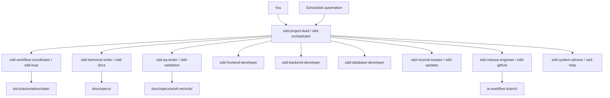

# SpecLoom

**Weave ideas into shipped code.**

SpecLoom is an installable spec-driven workflow for [Cursor](https://cursor.com) and [OpenAI Codex](https://openai.com/codex). It turns a codebase into a **spec loom**: ideas become features, features become dated specs, specs become validated implementation, and completed work merges back to a stable integration branch — with human sign-off at the draft stage and automation everywhere else.

You talk to **one agent** (the project lead). It delegates a full engineering crew behind the scenes.

---

## Table of contents

- [Why use SpecLoom?](#why-use-specloom)
- [When to use it](#when-to-use-it)
- [When not to use it](#when-not-to-use-it)
- [How it works](#how-it-works)
- [Prerequisites](#prerequisites)
- [Installation](#installation)
- [Bootstrap a repository](#bootstrap-a-repository)
- [Daily usage](#daily-usage)
- [Automations (hands-off runs)](#automations-hands-off-runs)
- [Git workflow](#git-workflow)
- [Agent team](#agent-team)
- [Validation gates](#validation-gates)
- [Troubleshooting](#troubleshooting)
- [Project structure](#project-structure)
- [Contributing](#contributing)

---

## Why use SpecLoom?

Most AI coding sessions are **one-shot**: you ask, the model edits, you review, repeat. That works for small fixes but breaks down on multi-week features because:

| Problem | SpecLoom answer |
|--------|------------------|
| Context evaporates between sessions | Specs + work-records + `docs/` are durable source of truth |
| No quality bar | Three validation gates (draft, work, test) with ≥99% confidence threshold |
| Agents improvise architecture | Features define *what*; specs define *how* with tasks and file paths |
| Git chaos | All AI work branches from `ai-workflow`, merges via PR, branch deleted after |
| You become the coordinator | Workflow coordinator runs priority: tasks → features → ideas → idle |
| Retry loops never end | **Rule of 3** — three failed attempts → `blocked_work.json`, session stops |

SpecLoom is opinionated on purpose. The opinions are what make long-running AI engineering predictable.

### What you get

- **10 specialized agents** (project lead, coordinator, technical writer, QA, frontend/backend/database devs, records keeper, release engineer, system advisor)
- **35+ skills** encoding loop procedures, validation rubrics, and coding standards
- **Repo scaffolding** — `docs/` tree, automation state, work-record templates, GitHub planning config
- **Loop engineering** — coordinator, spec creation, task execution, validation, review loops
- **Dual runtime** — Cursor (`.cursor/`) and Codex (`.codex/` + `.agents/skills/`)

---

## When to use it

Use SpecLoom when your project has **most** of these traits:

1. **Multi-step features** — work spans days or weeks, not a single chat
2. **You want specs before code** — dated spec files with explicit tasks beat ad-hoc prompts
3. **Quality matters** — you need lint, tests, and coverage gates, not just "it compiles"
4. **GitHub issue tracking** — ideas and features live as labeled issues (`sdd:idea`, `sdd:feature`)
5. **Repeatable automation** — Cursor Automations or Codex scheduled runs on `ai-workflow`
6. **A team-shaped workflow** — you want roles (writer, QA, dev) even if one human reviews

**Good fits:** product apps, internal tools, greenfield MVPs, refactors with clear acceptance criteria.

**Also good:** repos where you already use `AGENTS.md` and want a structured upgrade path.

---

## When not to use it

Skip SpecLoom if:

- You need a **single quick fix** — overhead of specs/issues won't pay off
- The project has **no tests** and you don't plan to add them (test gate will block constantly)
- You can't use **GitHub Issues** or `gh` CLI for planning
- You want **full manual control** of every file edit with no automation
- The codebase is a **throwaway prototype** you'll discard in a day

SpecLoom optimizes for **sustained engineering**, not spike hacks.

---

## How it works

### Three planning layers

```
Idea (GitHub Issue)  →  Feature (GitHub Issue)  →  Spec (docs/specs/)
     sdd:idea              sdd:feature              dated .md + tasks
```

| Layer | Where | Purpose |
|-------|-------|---------|
| **Idea** | GitHub issue `sdd:idea` + `sdd:status:backlog` | Raw problem or opportunity |
| **Feature** | GitHub issue `sdd:feature` | What to build; spawns spec queue |
| **Spec** | `docs/specs/MMDDYY_slug.md` | How to build one unit of work |

### Coordinator priority (automation)

The workflow coordinator always prefers **finishing in-flight work** over starting new ideas:

```
1. Ready tasks on Pending specs     → task execution
2. Ready features (spec queue row)  → spec creation
3. Backlog ideas                    → feature definition
4. Idle                             → stop
```

### Gate sequence (implementation)

```
All Ready tasks implemented
  → QA work validation (×3 max)
  → QA test validation (×3 max)
  → Records keeper finalizes work-records
  → Release engineer: push → PR → merge to ai-workflow → delete branch → archive spec
```

Draft specs and features **pause for your sign-off** after QA validation passes (≥99%). You get a review card with summary, estimated tokens, and open questions — reply **approved** / **sign off** in chat to continue. Implementation work/test gates still auto-advance.

### Architecture



**Critical rule:** Only the project lead speaks to you in natural language. Every other agent returns JSON internally; the lead summarizes outcomes.

---

## Prerequisites

| Requirement | Why |
|-------------|-----|
| **Node.js 18+** | Runs the installer (`install.mjs`) |
| **Cursor** and/or **Codex** | Host environment for custom agents |
| **Git** | Branch workflow, PRs |
| **[GitHub CLI](https://cli.github.com/)** (`gh`) | Idea/feature issues, planning queries |
| **A GitHub repo** | Planning issues + `ai-workflow` branch |

Optional but recommended:

- Cursor **Automations** or Codex **scheduled automations** for hands-off runs
- Existing test suite (unit + integration commands in `AGENTS.md`)

---

## Installation

### 1. Clone the repository

```bash
git clone https://github.com/AIHeart-Professional/specloom.git
cd specloom
```

### 2. Run the installer

**All platforms (recommended):**

```bash
node scripts/install.mjs --all
```

**Windows (PowerShell):**

```powershell
.\install.ps1 --all
```

**macOS / Linux:**

```bash
chmod +x install.sh
./install.sh --all
```

### Install options

| Flag | Effect |
|------|--------|
| `--cursor` | Install Cursor agents → `~/.cursor/agents/`, skills → `~/.cursor/skills/` |
| `--codex` | Install Codex agents → `~/.codex/agents/`, skills → `~/.agents/skills/` |
| `--all` | Both (default) |
| `--force` | Overwrite existing files (creates timestamped `.specloom-backup-*` first) |
| `--dry-run` | Print actions without writing |
| `--bootstrap <path>` | Scaffold `docs/` in target repo (see below) |

**Examples:**

```bash
# Cursor only
node scripts/install.mjs --cursor

# Codex only, preview changes
node scripts/install.mjs --codex --dry-run

# Install + bootstrap new app in one step
node scripts/install.mjs --all --bootstrap ~/Projects/my-app
```

### 3. Verify installation

**Cursor:** Open Agent panel → you should see `sdd-project-lead` as a subagent.

**Codex:** Custom agents list should include `sdd-orchestrator`.

**Skills:** Check `~/.cursor/skills/workflow-coordinator-loops/` (Cursor) or `~/.agents/skills/sdd-automation-loops/` (Codex).

### 4. Update later

Pull latest `specloom` and re-run with `--force`:

```bash
git pull
node scripts/install.mjs --all --force
```

---

## Bootstrap a repository

SpecLoom needs a `docs/` command center in each project repo. Bootstrap creates the full tree:

```bash
node scripts/install.mjs --bootstrap /path/to/your-repo
```

Or combine with global install:

```bash
node scripts/install.mjs --all --bootstrap ./my-app
```

### What gets created

```
your-repo/
├── AGENTS.md                          # Build/test commands (edit this!)
├── docs/
│   ├── README.md                      # Command center index
│   ├── specs/                         # Dated specs
│   ├── specs/work-records/            # Manifest + completion templates
│   ├── automation/
│   │   ├── loops/                     # 6 loop procedure files
│   │   ├── state/                     # active_work.json, blocked_work.json
│   │   ├── reports/                   # daily_summary, validation reports
│   │   └── github-planning.json       # GitHub repo + label config
│   ├── architecture/                  # System stubs
│   ├── decisions/                     # Durable Q&A tables
│   ├── knowledge/                     # Product/implementation memory
│   └── workflows/                     # Automation + orchestration notes
├── automation_inputs/                 # Local only (gitignored)
├── automation_outputs/                # Local only (gitignored)
└── local_data/                        # Local only (gitignored)
```

### Post-bootstrap checklist

1. **Edit `AGENTS.md`** — add your build, lint, typecheck, unit, integration, and E2E commands
2. **Edit `docs/automation/github-planning.json`** — set your `owner/repo` and label names
3. **Create `ai-workflow` branch** on GitHub:
   ```bash
   git checkout -b ai-workflow
   git push -u origin ai-workflow
   ```
4. **Authenticate GitHub CLI:** `gh auth login`
5. **Commit the docs tree** before enabling automations

---

## Daily usage

### Entry point

| Platform | Talk to | Example prompt |
|----------|---------|----------------|
| **Cursor** | `@sdd-project-lead` | "Run the coordinator until idle." |
| **Codex** | `sdd-orchestrator` | "What's the next SDD task on this repo?" |

### Common workflows

#### Sign off a feature or spec draft

After the team creates and validates a draft, you'll see something like:

```markdown
## Spec ready for your review — 062626_auth-filter

### What this will do
Adds JWT filter middleware and wires login flow to existing session store.

### Estimated tokens
~18,000 total (T1: 6k, T2: 8k, T3: 4k)

### Open questions
1. Use refresh tokens or session-only? — _default: session-only_

### Your move
Reply **approved** to promote and start implementation.
```

- **Sign off:** `approved`, `sign off`, `proceed`, `lgtm`, `go ahead`
- **Answer questions:** reply inline, then sign off
- **Request changes:** `revise: use refresh tokens and add logout endpoint`

#### Run until idle (automation-style)

```
@sdd-project-lead Run the coordinator with run_until_complete. Finish all Ready tasks, then stop.
```

The project lead delegates the workflow coordinator, which loops until `idle`, `blocked`, `needs_user`, or iteration cap.

#### Create an idea

```
@sdd-project-lead Create an idea for [problem]. Add it to the GitHub backlog.
```

Ideas stay in backlog until **you** manually promote them to features.

#### Promote idea → feature (manual)

```
@sdd-project-lead Promote idea IDEA-003 to a feature.
```

Automations never auto-promote ideas — only you trigger `feature_definition`.

#### Bootstrap help

```
@sdd-project-lead How does the spec creation loop work?
```

Routes to the system advisor; you get a plain-language answer.

#### Unblock after Rule of 3

Check `docs/automation/state/blocked_work.json`, fix the root cause, then:

```
@sdd-project-lead Clear the block on spec 060626_auth-filter and resume.
```

### What you do vs what automation does

| You | Automation |
|-----|------------|
| Create ideas (optional) | Run Ready tasks |
| Promote idea → feature | Create specs from Ready features |
| Answer open questions (`needs_user`) | Validate drafts, work, tests |
| Review `blocked_work.json` | Merge PRs to `ai-workflow` after gates pass |
| Set project direction | Archive completed specs |

---

## Automations (hands-off runs)

### Cursor Automations

1. Commit `docs/automation/` to your repo
2. Create automations that invoke **`sdd-project-lead`** (not sub-agents directly)
3. Set repository branch to **`ai-workflow`**
4. Use prompts from `docs/automation/cursor-schedules.md`

| Automation | Schedule (example) | Loop |
|------------|-------------------|------|
| Daily Coordinator | Daily 8 AM | `coordinator_loop.md` |
| Task Execution | Weekdays every 2h | `task_execution_loop.md` |
| Nightly Validation | Daily 11 PM | `validation_loop.md` |

**Important:** Automations must use `sdd-project-lead` so you never see raw JSON results.

### Codex automations

Same loop files and schedules. Entry agent is **`sdd-orchestrator`**. Set git base branch to **`ai-workflow`**.

---

## Git workflow

All SDD AI work uses **`ai-workflow`** as the integration branch — not `main`.

| Branch | Purpose |
|--------|---------|
| `ai-workflow` | Stable AI integration branch; base for all spec work |
| `feature/<spec-slug>` | One branch per spec; deleted after merge |

### Per-spec flow

1. Fetch `origin/ai-workflow`
2. Create `feature/<spec-slug>` from `ai-workflow`
3. Author and validate spec (≥99% confidence)
4. Implement all tasks on the same branch
5. Pass work + test validation
6. Open PR → merge to `ai-workflow` → delete branch

See `docs/automation/git-workflow.md` in bootstrapped repos for full detail.

---

## Agent team

### Cursor (`~/.cursor/agents/`)

| Agent | Role |
|-------|------|
| **sdd-project-lead** | Sole user entry; delegates everyone |
| **sdd-workflow-coordinator** | Loop routing, handoffs, gate sequences |
| **sdd-technical-writer** | Ideas, features, specs, repo bootstrap |
| **sdd-qa-tester** | All validation gates (work, test, feature, spec) |
| **sdd-frontend-developer** | UI implementation |
| **sdd-backend-developer** | API implementation |
| **sdd-database-developer** | Supabase / Postgres |
| **sdd-records-keeper** | Work-records, manifest, archive |
| **sdd-release-engineer** | Git, PRs, merges |
| **sdd-system-advisor** | SDD system help |

### Codex (`~/.codex/agents/`)

| Agent | Cursor equivalent |
|-------|-------------------|
| **sdd-orchestrator** | sdd-project-lead |
| **sdd-loop** | sdd-workflow-coordinator |
| **sdd-docs** | sdd-technical-writer |
| **sdd-validation** | sdd-qa-tester |
| **sdd-frontend / backend / database** | domain developers |
| **sdd-updates** | sdd-records-keeper |
| **sdd-github** | sdd-release-engineer |
| **sdd-help** | sdd-system-advisor |

---

## Validation gates

| Gate | When | Pass threshold | After pass |
|------|------|----------------|------------|
| **feature** | After feature draft | ≥99% confidence | **Pause** — review card → your chat sign-off → promote |
| **spec** | After spec draft | ≥99% confidence | **Pause** — review card → your chat sign-off → tasks start |
| **work** | All tasks done | ≥99% alignment + quality | Auto-advance to test gate |
| **test** | After work passes | ≥99% coverage + quality + regression | Auto closeout (PR, merge, archive) |

On pass:

- **feature / spec** — session stops at `awaiting_sign_off` until you approve in chat
- **work + test** — auto closeout (finalize, PR, merge, archive)

On 3 failures → `docs/automation/state/blocked_work.json` + session stops.

---

## Troubleshooting

### "I see raw JSON in the chat"

Wrong entry agent. Use **`sdd-project-lead`** (Cursor) or **`sdd-orchestrator`** (Codex) — not sub-agents directly.

### Test gate keeps failing

Ensure `AGENTS.md` has correct test commands. The QA agent runs your real suite, not a stub.

### `gh: command not found` or auth errors

Install and authenticate: `gh auth login`

### Coordinator always idle

Check:

- Any spec with `Status: Pending` and tasks `Ready`?
- Any feature issue with `sdd:status:ready` and a pending spec queue row?
- `docs/automation/state/active_work.json` for current workflow

### Codex can't find skills

Re-run installer: `node scripts/install.mjs --codex --force`

Skills install to `~/.agents/skills/`. Codex agent `.toml` files reference that path.

### Automations edit wrong branch

Set automation repository branch to **`ai-workflow`**, not `main`.

### Blocked work

Read `docs/automation/state/blocked_work.json` for `stopReason` and attempt counts. Fix underlying issue, then ask project lead to resume.

---

## Project structure

This repository (the installer) is separate from your application repo (the bootstrapped project).

```
specloom/                          ← this repo (installer)
├── README.md
├── install.sh / install.ps1
├── scripts/install.mjs
└── package/
    ├── cursor/agents/             # Cursor custom agents
    ├── cursor/skills/             # Cursor skills
    ├── codex/agents/              # Codex agent definitions
    ├── shared-skills/             # Codex skills (~/.agents/skills)
    └── repo-templates/            # Bootstrap templates for docs/

your-app/                          ← your project (bootstrapped)
├── AGENTS.md
└── docs/                          # SpecLoom command center
```

---

## Contributing

1. Fork and clone
2. Edit agents/skills in `package/`
3. Test: `node scripts/install.mjs --dry-run --all`
4. Open a PR

When updating agents, keep the **project lead / orchestrator** as the only user-facing agent.

---

## License

MIT — see [LICENSE](LICENSE).
