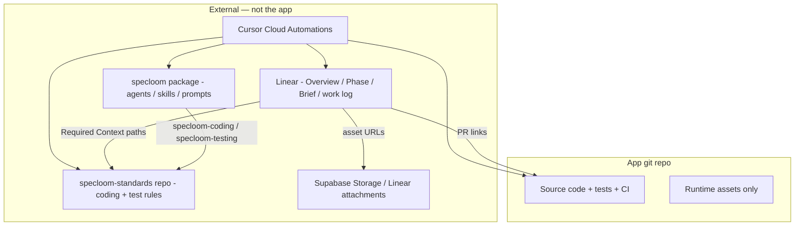
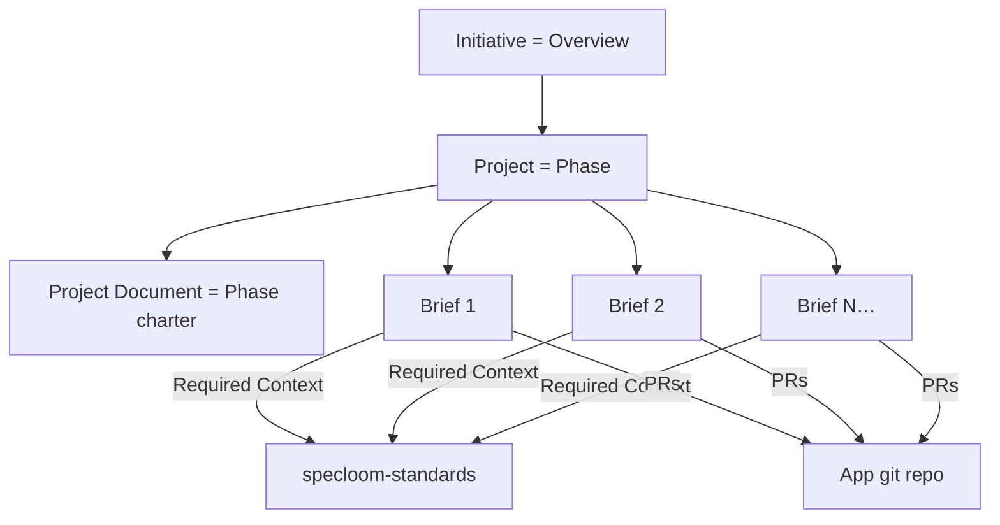
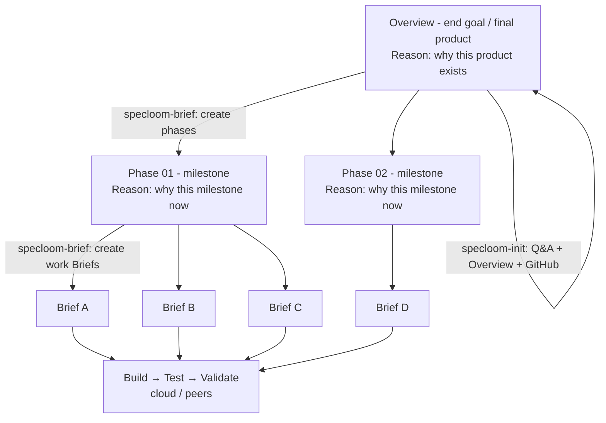
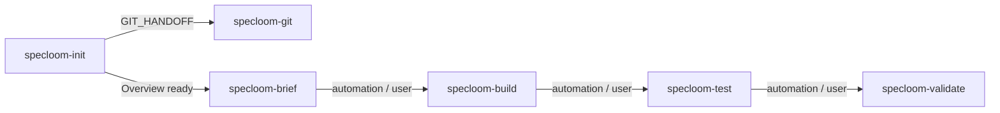

# SpecLoom — Linear Brief Workflow (Target)

> **Status:** Target architecture — agents/skills live in **`package/v2/`**. Install: `node scripts/install.mjs --v2 --cursor --force`.  
> Legacy v1: [`WORKFLOW.md`](WORKFLOW.md) + `package/v1/`.

This document describes the **new** SpecLoom workflow: product planning in **Linear**, engineering standards in an **external standards repo**, SpecLoom agents/skills outside the app, code in the **app repo**, **Cursor Cloud Automations** as runners, full-auto gates, no sign-off.

---

## 1. Goals

| Goal | Design choice |
|------|----------------|
| Planning out of the app repo | Linear (Initiative → Project → Issue) |
| Clear product narrative | Overview → Phases → Briefs |
| Phases carry real workload | **Almost always multiple Briefs per Phase** |
| Fewer layers | Remove ideas, features, specs naming |
| Names match jobs | Renamed peers / agents / skills (`specloom-*`) |
| Hands-off closeout | Full-auto; no human sign-off |
| Crash-safe resume | Linear status + task checkboxes + comments + git |
| Token-efficient standards | Small topic `.md` files; Brief lists subset |
| Universal standards loaders | `specloom-coding` + `specloom-testing` |
| Cloud automations can run the loop | External Linear + external standards + external SpecLoom package; app = code only |

---

## 2. Where things live (external vs app)

**Yes — planning and process run outside the application repo.** The app holds product code. Everything agents need to *decide what to build* and *how to build it* lives in external systems cloud automations can reach.



| Concern | Location | In app? |
|---------|----------|---------|
| Overview / Phase / Brief / work log | **Linear** | No |
| Coding + test rule markdown | **`specloom-standards` git repo** | No |
| Orchestrators, agents, skills | **`specloom` package** (this project / team Agents) | No |
| Design refs / PDFs | Supabase Storage + Linear attachments | No |
| Product source, unit/E2E tests, CI | **App repo** | Yes |
| Icons/fonts shipped in the binary | App `assets/` | Yes |
| Loop machine state / sign-off JSON | — (removed) | No |

**Cloud automation rule:** Automations must not depend on `docs/` inside the app for planning or standards. They pull Briefs from Linear MCP, standards from the standards repo (see §9), and SpecLoom behavior from team/cloud-installed agents/skills or a checked-out specloom package.

---

## 3. Hierarchy



| Concept | Store | Replaces |
|---------|-------|----------|
| **Overview** | Linear Initiative | Product README narrative in `docs/` |
| **Phase** | Linear Project + Document | `docs/phases/` + feature container role |
| **Brief** | Linear Issue | Features + specs |
| **Ideas** | — | Removed |
| **Work done** | Issue comments + status + linked PR | `docs/specs/work-records/*.md` |
| **Coding / test rules** | External `specloom-standards` | Fat language skills + in-app `docs/code/` |

### Phase ↔ Brief cardinality

- A **Phase almost always contains multiple Briefs** (normal case).
- One Brief ≈ one shippable vertical slice / bounded workload — not the whole phase.
- Phase Completes only when **all** Briefs on that Project are **Done**.
- Single-Brief phases are rare exceptions (tiny spike); do not design phases as one mega-Brief.

### Planning flow (keep context → break down → work)



| Step | Object | Who | Automated? |
|------|--------|-----|------------|
| 1. New project | Overview + GitHub + Phases + Briefs | **`specloom-init`** (+ **`specloom-git`**, layer advisory) | **Yes** — dynamic co-plan |
| 2. Later plan edits | Phase / work Brief | **`specloom-brief`** | **Yes** |
| 3. Execute | Build → Test → Validate | **`specloom-build` / `test` / `validate`** | **Yes** |

**Rule:** Overview on **Linear**. `specloom-brief` does not bootstrap repos. Init may create first Phases/Briefs; brief maintains after.

---

## 4. Naming — peers, agents, skills

All names keep the **`specloom-`** prefix. Rename so the label matches the job.

### 4.1 User-facing orchestrators (peers)

| Old | New | Job |
|-----|-----|-----|
| `specloom-work-creator` / ideas | **`specloom-init`** | NEW project: Q&A → Overview + GitHub/`ai-workflow` (Tasks **specloom-git**) |
| `specloom-work-creator` (ongoing) | **`specloom-brief`** | Phases + work Briefs (Issues) under Overview |
| `specloom-implement` | **`specloom-build`** | Implement production code for in-flight Brief |
| `specloom-tester` | **`specloom-test`** | Write and run tests for Brief |
| `specloom-validator` | **`specloom-validate`** | Final gate; mark Brief Done on pass |
| `specloom-git` | **`specloom-git`** | Git/GitHub; callable by user or **specloom-init** bootstrap |

**Independence:** peers never Task each other **except** `specloom-init` → `specloom-git` (`GIT_HANDOFF`). User/automation chains the rest.



| Runtime | Invoke |
|---------|--------|
| Cursor chat | `@specloom-init` · `@specloom-brief` · `@specloom-build` · `@specloom-test` · `@specloom-validate` · `@specloom-git` |
| Cloud Automation | Same agent names in automation instructions |

**Greenfield:** always `@specloom-init` first. Then `@specloom-brief`.

### 4.2 Internal agents (not user entry)

| Old | New | Job |
|-----|-----|-----|
| `specloom-worker` | **`specloom-build-worker`** | Build loop (≤N); owns domain developers |
| `specloom-worker-validation` | **`specloom-build-check`** | App runs + standards compliance after tasks |
| `specloom-frontend-developer` | **`specloom-frontend`** | Client / UI production code (web, RN, desktop UI, etc.) |
| `specloom-backend-developer` | **`specloom-backend`** | API / server production code |
| `specloom-database-developer` | **`specloom-database`** | Schema / RLS |
| `specloom-test-loop` | **`specloom-test-loop`** | Test implementation loop |
| `specloom-frontend-test-standards` | **`specloom-test-frontend`** | Frontend tests |
| `specloom-backend-test-standards` | **`specloom-test-backend`** | Backend tests |
| `specloom-database-test-standards` | **`specloom-test-database`** | DB / RLS tests |
| `specloom-standardized-loop` | **`specloom-validate-loop`** | Validation quality loop |
| `specloom-frontend-validator` | **`specloom-validate-frontend`** | Frontend validate |
| `specloom-backend-validator` | **`specloom-validate-backend`** | Backend validate |
| `specloom-database-validator` | **`specloom-validate-database`** | Database validate |
| `specloom-update-knowledgebase` | **`specloom-sync`** *(optional)* | Sync Linear comments / closeout; no in-app docs archive |

**No `specloom-game*`.** Game / MonoGame / C# client work is still **frontend** (or backend/database when that layer applies). Language + topic standards come from the Brief (`Language: csharp`, `csharp/monogame.md` in Required Context) via `specloom-coding` / `specloom-testing` — not a fourth domain agent.

Drop or absorb: legacy `specloom-game-*`, `specloom-system-advisor` (unless still needed for package help).

### 4.3 Universal skills (standards loaders)

| Old idea | New | Job |
|----------|-----|-----|
| `coding` / `code-python` / `code-*` | **`specloom-coding`** | Always load `<lang>/CORE.md`; then Brief Code Standards only |
| `tests` / `test-python` / `test-*` | **`specloom-testing`** | Always load `test/<lang>/CORE.md`; then Brief Test Standards only |

Domain agents load **`specloom-coding`** (builders) or **`specloom-testing`** (testers) — not a stack of language-specific fat skills.

---

## 5. Linear setup

### 5.1 Overview = Initiative

One Initiative per product. Vision, success criteria, ordered phases, product non-goals.

### 5.2 Phase = Project + Document

One Project per phase. Linked Document = charter.

**Roster = many Briefs.** Expect a table-worth of Issues per phase, not one.

**Phase Document sections:**

1. **Reason** — short: why this milestone exists toward Overview end goal  
2. Goal  
3. In scope / Out of scope  
4. Quality bar  
5. Completion criteria  
6. Brief roster (issue list is source of truth)

**Full-auto phase close:** all Briefs **Done** → Complete Project → start next Project. No human gate.

### 5.3 Brief = Issue

One Issue = one Brief.

**Workflow states:**

```
Backlog → Ready → Building → Testing → Validating → Done
         ↘ Blocked
         ↘ Failed
```

| State | Owner peer |
|-------|------------|
| Ready | `specloom-brief` finished body |
| Building | `specloom-build` |
| Testing | `specloom-test` |
| Validating | `specloom-validate` |
| Done | validate pass (auto) |
| Failed | remediation → build or test |

*(State name **Building** matches `specloom-build`; avoid “Implementing” after rename.)*

**Labels:** `brief` + **only** `frontend` / `backend` / `database` as needed. No `game` label or layer.

**Body sections:**

1. **Reason** — short: why this Brief exists toward the Phase goal (and Overview)  
2. Goal  
3. Required Context  
4. Requirements  
5. Task Directives  
6. Task checklist  
7. Acceptance criteria

### 5.4 Persistence (no `active_work.json`)

| Signal | Store |
|--------|-------|
| Pipeline stage | Issue status |
| Task progress | Checkboxes |
| Narrative / errors | Comments |
| Code truth | GitHub PR + branch |
| Phase / product rollup | Project / Initiative status |

Loop limits live in skills / automation config.

---

## 6. Resolve active work

1. **Brief** — Issue in `Building` / `Testing` / `Validating` (or key in prompt). Prefer one in-flight Brief per product (phase still has many Ready/Done Briefs).  
2. **Phase** — Issue’s Project + Document.  
3. **Overview** — Initiative if needed.  
4. **Resume** — unchecked tasks; verify git before trusting checkboxes.  
5. **Branch** — `task/<LINEAR-KEY>-<slug>` and/or linked PR.

---

## 7. Day-to-day pipeline

### 7.1 Bootstrap — `specloom-init` → `specloom-planner`

1. User `@specloom-init` — thin orchestrator.  
2. Tasks **`specloom-planner`** (dialogue, Overview, advisory, git, Phases/Briefs).  
3. Planner `need_user` → init asks user → `continue` HANDOFF.  
4. Planner `complete` → init summarizes → `@specloom-build` on first Ready.  
5. Later plan edits: `@specloom-brief` (not init).

### 7.1b Ongoing plan — `specloom-brief`

Add/edit Phases and Briefs under existing Overview (not greenfield bootstrap).

### 7.2 Build

1. `@specloom-build` or cloud automation.  
2. Status → **Building**.  
3. `specloom-coding` → manifest → `<lang>/CORE.md` + listed topics.  
4. Tasks → checkboxes → comments → PR.  
5. All tasks done → **Testing**; hand off to `specloom-test`.  

### 7.3 Test

1. `@specloom-test` / automation.  
2. `specloom-testing` → `test/<lang>/CORE.md` + listed topics.  
3. Pass → **Validating**. Fail → comment + **Failed** or back to **Building**.  

### 7.4 Validate (full-auto)

1. `@specloom-validate` / automation.  
2. Pass → **Done** immediately.  
3. Fail → owner tags; re-run build or test.  

### 7.5 Phase close

Last Brief Done → Complete Project → next Phase. Last Project Done → Complete Initiative.

---

## 8. Engineering standards (external repo)

**Coding and testing rules are not in the app.** They live in **`specloom-standards`** (separate git repo), consumed by local agents and **Cursor Cloud Automations**.

### 8.1 Layout

```
specloom-standards/
├── manifest.yaml
├── python/
│   ├── CORE.md
│   ├── entraid.md
│   └── fastapi-routes.md
├── typescript/
│   └── CORE.md
├── react-native/
│   └── CORE.md
└── test/
    ├── python/
    │   ├── CORE.md
    │   └── pytest-api.md
    └── typescript/
        └── CORE.md
```

### 8.2 Skills

| Skill | Always | Then |
|-------|--------|------|
| **`specloom-coding`** | `specloom-standards/<language>/CORE.md` | Brief **Code Standards** paths only |
| **`specloom-testing`** | `specloom-standards/test/<language>/CORE.md` | Brief **Test Standards** paths only |

Never browse the tree. Unlisted topics stay unloaded.

### 8.3 `manifest.yaml`

Maps language aliases, CORE templates, topic `when:` keywords for `specloom-brief`.

```yaml
coding:
  core_template: "{language}/CORE.md"
testing:
  core_template: "test/{language}/CORE.md"
rules:
  - Resolve language from Brief Task Directives
  - Always load CORE for that language
  - Load only Brief-listed topic paths
  - Never browse the standards tree
```

### 8.4 Brief lists subset

```markdown
### Code Standards
| Path | Purpose |
|------|---------|
| `python/entraid.md` | Entra / MSAL |
| `python/fastapi-routes.md` | FastAPI routes |

### Test Standards
| Path | Purpose |
|------|---------|
| `test/python/pytest-api.md` | API test patterns |
```

Skills still always load matching CORE files.

---

## 9. Cloud automation + external standards

Cursor Cloud Automations commonly check out **the app repo**. Standards must still be reachable **without** baking them into app `docs/`.

### 9.1 Recommended access pattern

| Layer | How cloud gets it |
|-------|-------------------|
| Brief / Phase / Overview | **Linear MCP** (dashboard-backed MCP on the automation) |
| SpecLoom agents / skills | Install as **Cursor team Agents & Skills** (or checkout `specloom` package in automation setup) — not copied into each app |
| Coding / test markdown | **Fetch from `specloom-standards` repo** at a pinned ref |

**Standards fetch (pick one primary; document in `specloom-coding` / `specloom-testing`):**

1. **Preferred — clone in automation setup**  
   Automation instructions (or setup script):  
   `git clone --depth 1 --branch <pin> <standards-remote> /workspace/specloom-standards`  
   Skills resolve paths under `/workspace/specloom-standards/…`.

2. **Alternative — `gh` / raw GitHub API**  
   For each Brief-listed path: fetch file contents from `owner/specloom-standards@<sha>`.  
   No clone; slightly more API chatter; works when only sparse files needed.

3. **Avoid for cloud** — app git submodule of standards  
   Puts standards *inside* the app tree (what we are removing). Local-only submodule optional for humans; cloud should use (1) or (2).

4. **Avoid** — embedding all CORE/topic text inside skills  
   Duplicates, bloats every run, hard to update once.

### 9.2 Example automation chain

Separate automations or one scheduled runner that invokes the right peer by Linear status:

| Trigger | Peer | Needs |
|---------|------|-------|
| Schedule / Linear Ready | `specloom-build` | Linear MCP, app repo, standards clone, specloom-coding |
| Brief → Testing | `specloom-test` | + specloom-testing |
| Brief → Validating | `specloom-validate` | Linear + app + standards (for score) |

Each automation prompt:

1. Resolve in-flight Brief from Linear.  
2. Ensure standards checkout at pinned SHA (from Brief or workspace default pin).  
3. Run peer algorithm (§14).  
4. Update Linear status / comments; open or update PR on app repo.

### 9.3 Pinning

- Brief or workspace config records **`standards_ref:`** (tag or commit SHA).  
- Automations must not float on `main` of standards without a pin — reproducibility.  
- Bump pin deliberately when rule changes should apply.

---

## 10. Assets

| Type | Store |
|------|--------|
| Design / reference images | Supabase Storage + optional Linear attachments |
| Long docs | Linear Document / attachment |
| Figma | Export for agents; link for humans |
| App-shipped binaries | App repo only |

---

## 11. Token discipline

1. One in-flight Brief per run (phase may have many others).  
2. Phase Document when aligning scope.  
3. Initiative only if needed.  
4. CORE + listed topics only.  
5. Comments over full history dumps.  
6. No sidecar machine-state file.

---

## 12. Decisions locked

| Topic | Decision |
|-------|----------|
| Briefs per phase | **Multiple** (almost always) |
| Phase + Brief | Each has short **Reason** (why it exists) |
| New project | **`specloom-init`** — Overview + GitHub via **`specloom-git`** (no Phases) |
| Planning automation | **`specloom-brief`** — Phases + work Briefs |
| Level-3 name | **Brief** (Issue) |
| Peer names | **`init` / `brief` / `build` / `test` / `validate` / `git`** |
| Domain agents | **frontend / backend / database only** (no game lane) |
| Standards loaders | **`specloom-coding` / `specloom-testing`** |
| Sign-off | Full-auto |
| Ideas | Removed |
| Planning | Linear (external) |
| Coding / test rules | **`specloom-standards` repo (external)** |
| SpecLoom runtime | **Package / team Agents (external to app)** |
| App repo | Code + runtime assets + CI only |
| Cloud | Cursor Automations + Linear MCP + standards clone/fetch |
| RAG | No for standards |
| Loop JSON | Not required |

---

## 13. Migration sketch

1. Linear Initiative + multi-Brief Projects for phases.  
2. Port specs → many Briefs per phase.  
3. Create `specloom-standards` repo + `manifest.yaml`.  
4. Rename peers/agents/skills in specloom package; **remove `specloom-game-*`**.  
5. Implement `specloom-coding` / `specloom-testing` with external path resolution.  
6. Wire Linear MCP + standards clone into Cloud Automation prompts.  
7. Strip app `docs/` planning and in-app standards dependency.  
8. Replace live [`WORKFLOW.md`](WORKFLOW.md) with this contract when cut over.

---

## 14. Session algorithm

```
1. Connect Linear MCP
2. Resolve in-flight Brief (status or key)
3. Load Project Document (phase charter) — phase has multiple Briefs; this is one of them
4. Ensure specloom-standards available at pinned ref (clone or fetch)
5. Match peer: Building→build, Testing→test, Validating→validate
6. specloom-coding or specloom-testing → manifest → CORE + Brief-listed paths
7. Next unchecked task; verify git; comment; check box
8. Gate pass → advance Linear status; next peer / automation
9. Validate pass → Done; if no open Briefs on Project → complete Phase
```

---

*End of target workflow. Implementation = package renames + Linear cutover + standards repo + cloud wiring after explicit adoption.*
