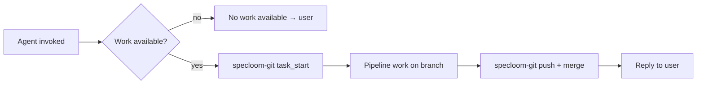
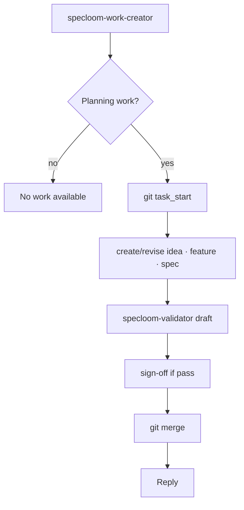
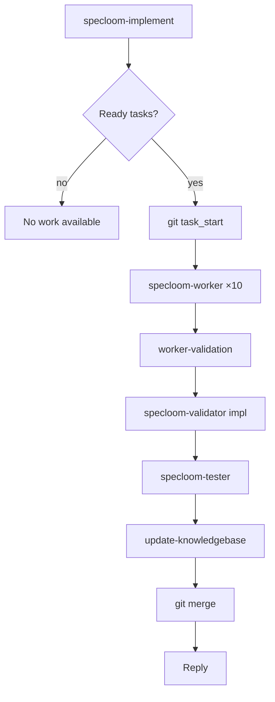
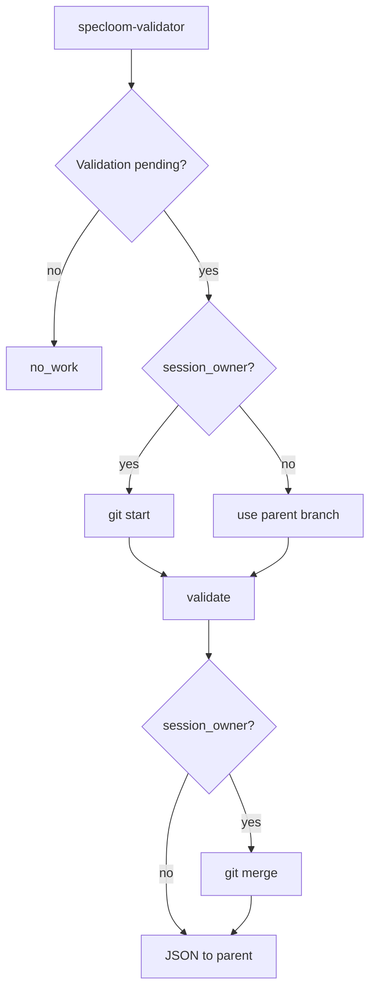
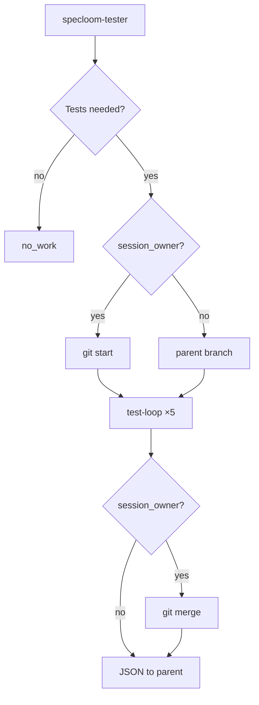

# SpecLoom — Four-Agent Workflow

Every orchestrator shares **specloom-orchestrator-session**: work discovery → git start → work → git merge → reply.

**No work** → `no work available` immediately. **No git** on no_work.

**Priority:** specs always before features.

---

## Universal session contract



| Step | Rule |
|------|------|
| 0 | Scan queues + `blocked_work.json` + blocked status |
| 1 | `no_work` → stop, no git |
| 2 | `specloom-git task_start` off `ai-workflow` |
| 3 | All work on `git_task_branch` |
| 4 | `task_push` + `merge_to_ai_workflow` **before** user reply |
| Delegated | Sub-agents use parent branch; parent owns merge |

---

## Work priority (global)

```
Specs (Pending / In Progress with open tasks)
  → only when none: Features (Ready, spec queue)
    → only when none: Ideas (user-requested)
```

**Blocked** spec, feature, or `blocked_work.json` entry → **no work** for that item.

---

## 1. specloom-work-creator

**Entry:** `@specloom-work-creator`



| No work when |
|--------------|
| No Ready features with spec queue rows |
| Spec work exists (spec-over-feature) |
| Blocked feature/spec |
| Awaiting sign-off |

**Git:** start + merge every session.

---

## 2. specloom-implement

**Entry:** `@specloom-implement`



| No work when |
|--------------|
| No Ready/In Progress tasks |
| Spec blocked |
| `blocked_work.json` |

**Git:** one branch for full pipeline; validator/tester use same branch (`session_owner: false`).

---

## 3. specloom-validator

**Entry:** direct invoke OR delegated by work-creator / implement



| Priority | Mode |
|----------|------|
| 1 | Implementation validation |
| 2 | Draft validation (only if no impl work) |

| No work when |
|--------------|
| Draft: nothing to validate |
| Impl: tasks incomplete / worker-validation not passed |
| Blocked |

---

## 4. specloom-tester

**Entry:** direct invoke OR delegated by implement



| No work when |
|--------------|
| Tasks incomplete |
| Validator not passed |
| `tests_passed` |
| Blocked |

---

## specloom-git (sub-agent)

Called at **start** and **end** of every `session_owner: true` session.

| Phase | Action |
|-------|--------|
| Start | `task_start` → new branch off `ai-workflow` |
| End | `task_push` → `merge_to_ai_workflow` |

Never parallel. Merge failure → report blocked, not success.

---

## Full lifecycle (typical)

```
@specloom-work-creator
  git → spec draft → validate → sign-off → promote → git merge

@specloom-implement
  git → implement → validate → test → knowledgebase → git merge
```

Validator/tester may also run standalone with own git bookends.

---

## JSON status values

| status | Meaning |
|--------|---------|
| `no_work` | Nothing to do — no git ran |
| `complete` | Work done + merged (if session_owner) |
| `fail` | Work failed; merge attempted per policy |
| `blocked` | Git merge/push failed or rule of 3 |
