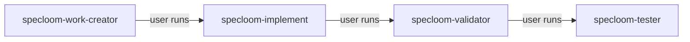

# SpecLoom — Five Independent Orchestrators

Five **peer** orchestrators. **None call each other.** User chains manually.

| Agent | Invoke | Scope | Loop cap |
|-------|--------|-------|----------|
| **specloom-work-creator** | `@specloom-work-creator` | Planning docs | — |
| **specloom-implement** | `@specloom-implement` | **specloom-worker** only | **10** |
| **specloom-validator** | `@specloom-validator` | **specloom-standardized-loop** only | **3** |
| **specloom-tester** | `@specloom-tester` | **specloom-test-loop** only | **5** |
| **specloom-git** | `@specloom-git` | Git only | — |

---

## Independence rule

```
FORBIDDEN: any peer → any other peer (Task delegation)
```

Each orchestrator:
1. Work discovery → `no_work` or continue
2. Git start (shell via **specloom-git-workflow**)
3. Own scope only
4. Git merge
5. Reply user + suggest **next peer** to run

**specloom-git** agent = standalone git sessions. Other orchestrators run git themselves — they do **not** invoke `@specloom-git`.

---

## Recommended user pipeline



Each box = **separate chat invocation**. No auto-chain.

---

## 1. specloom-work-creator

- Creates ideas, features, specs
- **Does not** call validator — user runs `@specloom-validator` after drafts
- Sign-off → promote → tell user `@specloom-implement`

---

## 2. specloom-implement

**Only sub-agent:** `specloom-worker` (≤10)

```
worker → domain developers → worker-validation → task_sync
```

**Does not** list validator/tester caps. **Does not** call validator, tester, work-creator, or git agent.

When tasks complete → tell user `@specloom-validator`.

---

## 3. specloom-validator

**Only sub-loop:** `specloom-standardized-loop` (≤3) for implementation mode

Draft mode: **specloom-work-creator-draft-validation** skill in-process.

Pass → tell user `@specloom-tester`.

---

## 4. specloom-tester

**Only sub-loop:** `specloom-test-loop` (≤5)

Precondition: validator passed. Pass → done.

---

## 5. specloom-git

Git-only. No sub-agents.

---

## Sub-agent tree (not peers)

```
specloom-implement
  └── specloom-worker (≤10)
        ├── specloom-frontend/backend/database-developer
        ├── specloom-worker-validation
        └── (implement) specloom-update-knowledgebase task_sync

specloom-validator
  └── specloom-standardized-loop (≤3)
        └── specloom-*-validator

specloom-tester
  └── specloom-test-loop (≤5)
        └── specloom-*-test-standards
```

---

## Session contract (all peers)

See **specloom-orchestrator-session** skill.
