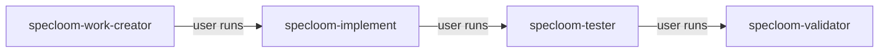

# SpecLoom — Five Independent Orchestrators

Five **peer** orchestrators. **None call each other.** User chains manually.

## User entry — five independent peers

| Runtime | Invoke |
|---------|--------|
| **Cursor** | `@specloom-work-creator` · `@specloom-implement` · `@specloom-validator` · `@specloom-tester` · `@specloom-git` |
| **Antigravity** | `/specloom-work-creator` · `/specloom-implement` · `/specloom-validator` · `/specloom-tester` · `/specloom-git` |
| **Codex** | `specloom-work-creator` · `specloom-implement` · etc. (custom agents) |

---

## Independence rule

```
FORBIDDEN: any peer → any other peer (Task delegation)
```

Each orchestrator:
1. Work discovery → `no_work` or continue
2. Git start (shell via **specloom-git-workflow**)
3. Own scope only
4. Git merge
5. Reply user + suggest **next peer** to run

**specloom-git** agent = standalone git sessions. Other orchestrators run git themselves — they do **not** invoke `@specloom-git`.

---

## Approval mode (implement · validator · tester)

| Command | Default | Effect |
|---------|---------|--------|
| `/manual` | **yes** | Review card after pass; **no archive** until `/approve` |
| `/auto` | | Validator archives on final pass |
| `/approve` | | Confirm pending sign-off (manual follow-up) |

Persist `approvalMode` in `docs/automation/state/active_work.json`. See **specloom-approval-mode**.

```
@specloom-implement /auto
@specloom-validator /manual
@specloom-tester /approve
```

---

## Recommended user pipeline



Each box = **separate chat invocation**. No auto-chain.

---

## 1. specloom-work-creator

- Creates ideas, features, specs
- **Does not** call validator — user runs `@specloom-validator` after drafts
- Sign-off → promote → tell user `@specloom-implement`

---

## 2. specloom-implement

**Only sub-agent:** `specloom-worker` (≤10)

```
worker → domain developers (production code ONLY)
     → worker-validation (app runs + doc/spec standards)
     → task_sync
```

Domain developers load **code-*** skills only. **Never** write tests or load **test-*** skills.

**Does not** call validator, tester, or other peers.

When tasks complete → tell user `@specloom-tester`.

On validator remediation → read `## Validation Results` (`owner:implement`) and fix.

---

## 3. specloom-tester

**Only sub-loop:** `specloom-test-loop` (≤5)

Runs **after implement**, **before validator**. Preconditions: `awaiting_tests` (not validator pass).

Pass → `tests_passed` → tell user `@specloom-validator`.

On validator remediation → fix `owner:tester` issues.

**Does not archive.**

---

## 4. specloom-validator

**Final gate** after tests. Re-runs tests + **specloom-standardized-loop** (≤3).

Precondition: `tests_passed`.

Pass → **sign-off / archive** (`/auto` immediate, `/manual` on `/approve`).

Fail → tag issues `owner:implement` / `owner:tester` → route back.

Draft mode: **specloom-work-creator-draft-validation** (no test prerequisite).

---

## 5. specloom-git

Git-only. No sub-agents.

---

## Sub-agent tree (not peers)

```
specloom-implement
  └── specloom-worker (≤10)
        ├── specloom-frontend/backend/database-developer
        ├── specloom-worker-validation
        └── (implement) specloom-update-knowledgebase task_sync

specloom-tester
  └── specloom-test-loop (≤5)
        └── specloom-*-test-standards

specloom-validator
  └── specloom-standardized-loop (≤3)
        └── specloom-*-validator
```

---

## Session contract (all peers)

See **specloom-orchestrator-session** skill.
