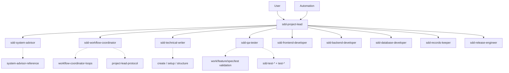

# SDD System Reference

Global: `~/.cursor/`. Repo: `{repo}/docs/`.

**Loaded by:** **sdd-system-advisor** only (via **sdd-project-lead** delegation).

---

## Team roster (job roles)

| Agent | Job title | User-facing? |
|-------|-----------|--------------|
| **sdd-project-lead** | Project Lead / Engineering Manager | **Yes** ? sole entry |
| **sdd-workflow-coordinator** | Workflow Coordinator | No |
| **sdd-system-advisor** | System Advisor | No |
| **sdd-technical-writer** | Technical Writer | No |
| **sdd-qa-tester** | QA Tester | No |
| **sdd-frontend-developer** | Frontend Developer | No |
| **sdd-backend-developer** | Backend Developer | No |
| **sdd-database-developer** | Database Developer | No |
| **sdd-records-keeper** | Records Keeper | No |
| **sdd-release-engineer** | Release Engineer | No |

Skill naming: `{role}-{capability}` (e.g. `qa-tester-e2e`, `frontend-developer-react`).

---

## User entry

| Who | Role |
|-----|------|
| **sdd-project-lead** | Sole user-facing agent. Delegates sub-agents. **Never reads skills.** |
| User | Talks to **sdd-project-lead** only ? not skills, not internal agents |

**Help flow:** User question ? **sdd-project-lead** ? **sdd-system-advisor** ? reads this skill ? JSON `HELP_RESULT` ? project lead phrases answer.

---

## Output contract

| Agent | Speaks to user |
|-------|----------------|
| **sdd-project-lead** | Yes ? natural language |
| **All other sdd-* agents** | **No** ? JSON Results only, low token |

Sub-agents return a single JSON object per reply. **sdd-project-lead** parses and translates for the user ? **never pastes JSON in the user-visible reply**.

Cursor Automations: set agent to **sdd-project-lead**; sub-agent JSON is internal only.

Schemas in **project-lead-protocol** (loaded by **sdd-workflow-coordinator**).

---

## Architecture principle

```
User ? sdd-project-lead ? sub-agent ? skill(s)
```

**sdd-project-lead never loads skills.** Every skill has exactly one (or two) loader agents.

---

## Agents

| Agent | Invoked by | Loads skills | Purpose |
|-------|------------|--------------|---------|
| **sdd-project-lead** | User, automation | **none** | Delegate only |
| **sdd-system-advisor** | sdd-project-lead | **system-advisor-reference** | Explain SDD |
| **sdd-workflow-coordinator** | sdd-project-lead | **workflow-coordinator-loops**, **workflow-coordinator-***, **project-lead-protocol**, **technical-writer-docs-planning** | Workflow routing + Handoffs |
| **sdd-technical-writer** | sdd-project-lead | **technical-writer-create-***, **technical-writer-workflow-setup**, **technical-writer-docs-structure**, **technical-writer-docs-planning** | Author docs + planning issues |
| **sdd-qa-tester** | sdd-project-lead | **qa-tester-***, **records-keeper-work-records**, **technical-writer-docs-planning** | All gates (work + test + drafts) |
| **sdd-records-keeper** | sdd-project-lead | **technical-writer-docs-structure**, **records-keeper-work-records**, **technical-writer-docs-planning** | Sync, archive |
| **sdd-frontend-developer** | sdd-project-lead | **frontend-developer-***, **qa-tester-*** (TS, React, RN) + repo `standards` | UI code |
| **sdd-backend-developer** | sdd-project-lead | **backend-developer-python**, **qa-tester-python** (+ TS pair if needed) | API code |
| **sdd-database-developer** | sdd-project-lead | **database-developer-postgres**, **qa-tester-postgres** | Supabase |
| **sdd-release-engineer** | sdd-project-lead | ? | Git |

---

## Skills (all internal)

| Skill | Loader agent |
|-------|--------------|
| system-advisor-reference | **sdd-system-advisor** |
| workflow-coordinator-loops | **sdd-workflow-coordinator** (index) |
| workflow-coordinator-coordinator | **sdd-workflow-coordinator** |
| workflow-coordinator-task-execution | **sdd-workflow-coordinator** |
| workflow-coordinator-spec-creation | **sdd-workflow-coordinator** |
| workflow-coordinator-feature-definition | **sdd-workflow-coordinator** |
| workflow-coordinator-validation | **sdd-workflow-coordinator** |
| workflow-coordinator-auto-closeout | **sdd-workflow-coordinator** |
| project-lead-protocol | **sdd-workflow-coordinator** |
| technical-writer-docs-planning | **sdd-workflow-coordinator**, **sdd-technical-writer**, **sdd-qa-tester**, **sdd-records-keeper** |
| technical-writer-create-idea | **sdd-technical-writer** |
| technical-writer-create-feature | **sdd-technical-writer** |
| technical-writer-create-spec | **sdd-technical-writer** |
| technical-writer-workflow-setup | **sdd-technical-writer** |
| technical-writer-docs-structure | **sdd-technical-writer**, **sdd-records-keeper** |
| qa-tester-test-validation | **sdd-qa-tester** |
| qa-tester-work-validation | **sdd-qa-tester** |
| qa-tester-feature-validation | **sdd-qa-tester** |
| qa-tester-spec-validation | **sdd-qa-tester** |
| frontend-developer-typescript | **sdd-frontend-developer**, **sdd-backend-developer** |
| frontend-developer-react | **sdd-frontend-developer** |
| frontend-developer-react-native | **sdd-frontend-developer** |
| backend-developer-python | **sdd-backend-developer** |
| database-developer-postgres | **sdd-database-developer** |
| qa-tester-unit | **sdd-qa-tester** |
| qa-tester-integration | **sdd-qa-tester** |
| qa-tester-e2e | **sdd-qa-tester** |
| qa-tester-coverage | **sdd-qa-tester** |
| qa-tester-regression | **sdd-qa-tester** |
| qa-tester-typescript | **sdd-qa-tester**, **sdd-frontend-developer**, **sdd-backend-developer** |
| qa-tester-react | **sdd-qa-tester**, **sdd-frontend-developer** |
| qa-tester-react-native | **sdd-qa-tester**, **sdd-frontend-developer** |
| qa-tester-python | **sdd-qa-tester**, **sdd-backend-developer** |
| qa-tester-postgres | **sdd-qa-tester**, **sdd-database-developer** |
| records-keeper-work-records | **sdd-records-keeper** (write), **sdd-qa-tester**, **sdd-qa-tester** (read manifest) |

**code-* + test-* pairs:** domain agents load both when implementing or fixing tests. Multiple skills per agent is required.

---

## Call graph



---

## Coordinator priority (automation)

1. Task `Ready` ? domain agents via **sdd-workflow-coordinator**
2. Feature `Ready` (`docs/features/`) ? **sdd-technical-writer** ? **sdd-qa-tester**(spec)
3. Else ? `idle`

Ideas optional; manual promotion only (user ? **sdd-project-lead**).

---

## Gate order

```
all Ready tasks (continuous per session)
  ? sdd-qa-tester(work)?3 ? sdd-qa-tester(test)?3
  ? sdd-records-keeper finalize ? auto_closeout (archive + git)
  ? coordinator next work
```

Draft: validate → **awaiting_sign_off** at ≥99% → user chat sign-off → promote → continue.

## User involvement

Create idea | unblock | needs_user only.

---

## Handoff types

| Packet | Target agent |
|--------|--------------|
| HELP_HANDOFF | sdd-system-advisor |
| LOOP_HANDOFF | sdd-workflow-coordinator |
| DOCS_HANDOFF | sdd-technical-writer |
| VALIDATION_HANDOFF | sdd-qa-tester (`work` \| `test` \| `feature` \| `spec`) |
| HANDOFF | frontend / backend / database |
| UPDATES_HANDOFF | sdd-records-keeper |

Schemas in **project-lead-protocol** (loaded by **sdd-workflow-coordinator**).

---

## Quick lookup

| I want? | Ask |
|---------|-----|
| SDD help / what calls what | **sdd-project-lead** (? sdd-system-advisor) |
| Run next task | **sdd-project-lead** (? sdd-workflow-coordinator ? ?) |
| Create idea/feature/spec | **sdd-project-lead** (? sdd-technical-writer) |
| Bootstrap repo | **sdd-project-lead** (? sdd-technical-writer bootstrap) |

---

## File index

```
~/.cursor/agents/
  sdd-project-lead.md   ? USER
  sdd-system-advisor.md
  sdd-workflow-coordinator.md
  sdd-technical-writer.md
  sdd-qa-tester.md
  sdd-frontend-developer.md
  sdd-backend-developer.md
  sdd-database-developer.md
  sdd-records-keeper.md
  sdd-release-engineer.md
```
