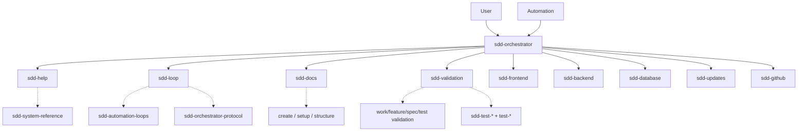

# SDD System Reference

Global: `Codex global config (~/.codex/agents and ~/.agents/skills)`. Repo: `{repo}/docs/`.

**Loaded by:** **sdd-help** only (via **sdd-orchestrator** delegation).

---

## User entry

| Who | Role |
|-----|------|
| **sdd-orchestrator** | Sole user-facing agent. Delegates sub-agents. **Never reads skills.** |
| User | Talks to **sdd-orchestrator** only — not skills, not internal agents |

**Help flow:** User question → **sdd-orchestrator** → **sdd-help** → reads this skill → JSON `HELP_RESULT` → orchestrator phrases answer.

---

## Output contract

| Agent | Speaks to user |
|-------|----------------|
| **sdd-orchestrator** | Yes — natural language |
| **All other sdd-* agents** | **No** — JSON Results only, low token |

Sub-agents return a single JSON object per reply. **sdd-orchestrator** parses and translates for the user.

Schemas in **sdd-orchestrator-protocol** (loaded by **sdd-loop**).

---

## Architecture principle

```
User → sdd-orchestrator → sub-agent → skill(s)
```

**sdd-orchestrator never loads skills.** Every skill has exactly one (or two) loader agents.

---

## Agents

| Agent | Invoked by | Loads skills | Purpose |
|-------|------------|--------------|---------|
| **sdd-orchestrator** | User, automation | **none** | Delegate only |
| **sdd-help** | sdd-orchestrator | **sdd-system-reference** | Explain SDD |
| **sdd-loop** | sdd-orchestrator | **sdd-automation-loops**, **sdd-orchestrator-protocol**, **sdd-github-planning** | Coordinator, Handoffs |
| **sdd-docs** | sdd-orchestrator | **sdd-create-***, **sdd-workflow-setup**, **sdd-docs-structure**, **sdd-github-planning** | Author docs + planning issues |
| **sdd-validation** | sdd-orchestrator | **sdd-work/feature/spec/test-validation**, **sdd-test-***, **test-***, **sdd-work-records**, **sdd-github-planning** | All gates (work + test + drafts) |
| **sdd-updates** | sdd-orchestrator | **sdd-docs-structure**, **sdd-work-records**, **sdd-github-planning** | Sync, archive |
| **sdd-frontend** | sdd-orchestrator | **code-*** + **test-*** (TS, React, RN) + repo `standards` | UI code |
| **sdd-backend** | sdd-orchestrator | **code-python**, **test-python** (+ TS pair if needed) | API code |
| **sdd-database** | sdd-orchestrator | **code-postgres**, **test-postgres** | Supabase |
| **sdd-github** | sdd-orchestrator | — | Git |

---

## Skills (all internal)

| Skill | Loader agent |
|-------|--------------|
| sdd-system-reference | **sdd-help** |
| sdd-automation-loops | **sdd-loop** |
| sdd-orchestrator-protocol | **sdd-loop** |
| sdd-github-planning | **sdd-loop**, **sdd-docs**, **sdd-validation**, **sdd-updates** |
| sdd-create-idea | **sdd-docs** |
| sdd-create-feature | **sdd-docs** |
| sdd-create-spec | **sdd-docs** |
| sdd-workflow-setup | **sdd-docs** |
| sdd-docs-structure | **sdd-docs**, **sdd-updates** |
| sdd-test-validation | **sdd-validation** |
| sdd-work-validation | **sdd-validation** |
| sdd-feature-validation | **sdd-validation** |
| sdd-spec-validation | **sdd-validation** |
| code-typescript | **sdd-frontend**, **sdd-backend** |
| code-react | **sdd-frontend** |
| code-react-native | **sdd-frontend** |
| code-python | **sdd-backend** |
| code-postgres | **sdd-database** |
| sdd-test-unit | **sdd-validation** |
| sdd-test-integration | **sdd-validation** |
| sdd-test-e2e | **sdd-validation** |
| sdd-test-coverage | **sdd-validation** |
| sdd-test-regression | **sdd-validation** |
| test-typescript | **sdd-validation**, **sdd-frontend**, **sdd-backend** |
| test-react | **sdd-validation**, **sdd-frontend** |
| test-react-native | **sdd-validation**, **sdd-frontend** |
| test-python | **sdd-validation**, **sdd-backend** |
| test-postgres | **sdd-validation**, **sdd-database** |
| sdd-work-records | **sdd-updates** (write), **sdd-validation**, **sdd-validation** (read manifest) |

**code-* + test-* pairs:** domain agents load both when implementing or fixing tests. Multiple skills per agent is required.

---

## Call graph



---

## Coordinator priority

1. Task `Ready` → **sdd-loop** → **sdd-orchestrator** delegates domain agents
2. Feature `Ready` (GitHub issue) → **sdd-docs** → **sdd-validation**(spec)
3. Idea (GitHub backlog issue) → **sdd-docs** → **sdd-validation**(feature)

---

## Gate order

```
tasks done -> sdd-validation(work)x3 -> sdd-validation(test)x3 -> sdd-updates(finalize) -> sdd-github(PR merge to ai-workflow + delete branch) -> sdd-updates(archive)
```

---

## Handoff types

| Packet | Target agent |
|--------|--------------|
| HELP_HANDOFF | sdd-help |
| LOOP_HANDOFF | sdd-loop |
| DOCS_HANDOFF | sdd-docs |
| VALIDATION_HANDOFF | sdd-validation (`work` \| `test` \| `feature` \| `spec`) |
| HANDOFF | frontend / backend / database |
| UPDATES_HANDOFF | sdd-updates |

Schemas in **sdd-orchestrator-protocol** (loaded by **sdd-loop**).

---

## Quick lookup

| I want… | Ask |
|---------|-----|
| SDD help / what calls what | **sdd-orchestrator** (→ sdd-help) |
| Run next task | **sdd-orchestrator** (-> sdd-loop; uses active `feature/<spec-slug>` branch) |
| Create idea/feature/spec | **sdd-orchestrator** (→ sdd-docs) |
| Bootstrap repo | **sdd-orchestrator** (→ sdd-docs bootstrap) |

---

## File index

```
~/.codex/agents/
  sdd-orchestrator.md   ← USER
  sdd-help.md
  sdd-loop.md
  sdd-docs.md
  sdd-validation.md
  sdd-frontend.md
  sdd-backend.md
  sdd-database.md
  sdd-updates.md
  sdd-github.md
```

## Codex Port

This skill was ported from the Cursor SDD system. It is internal and should be used only by the assigned `sdd-*` Codex custom agent. Implicit invocation is disabled in `agents/openai.yaml`.
