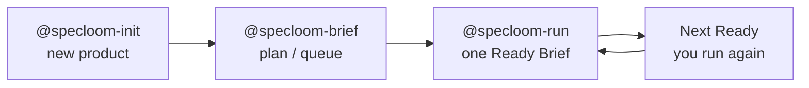
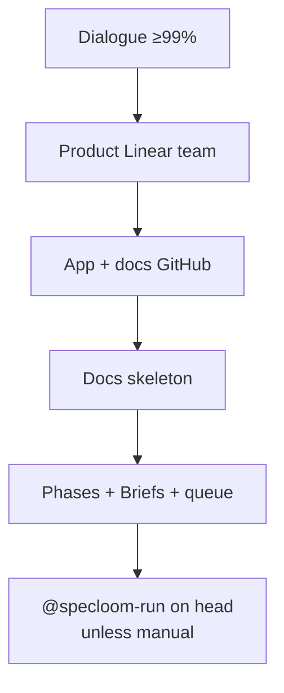
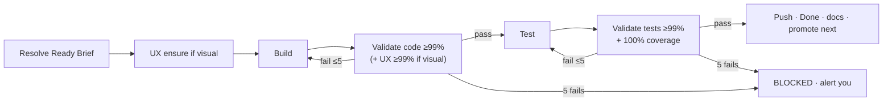

# SpecLoom v2 — Workflow & Functionality

> Agents + skills catalog and end-to-end workflow.  
> Install: `node scripts/install.mjs --v2 --cursor --force`  
> **Canonical v2 workflow (new roles + old rules):** [`WORKFLOW-V2.md`](./WORKFLOW-V2.md)  
> Narrative history: [`WORKFLOW-LINEAR.md`](../../WORKFLOW-LINEAR.md)

---

## 0. Workflow (what you run)

### 0.1 Product lifecycle



Helpers: `@specloom-document` (docs) · `@specloom-git` (remotes / `ai-workflow`).

Truth:

| Where | What |
|-------|------|
| Linear | Overview → Phase → Brief |
| App git `ai-workflow` | Code + tests |
| Docs git `main` | Architecture, UX refs, specs |

### 0.2 New product — `@specloom-init`



Later plan edits → `@specloom-brief`, not init again.

### 0.3 One Brief — `@specloom-run`



You do **not** `@` build / test / validate — run owns them. Run does **not** auto-start the next SPE.

### 0.4 Who you @mention

| Peer | When | Does |
|------|------|------|
| `@specloom-init` | Brand-new product | Team, repos, first Phases/Briefs |
| `@specloom-brief` | Change the plan | Phases/Briefs/queue/UX → optional run |
| `@specloom-run` | Ship next Ready Brief | Build → validate → test → validate → Done |
| `@specloom-document` | Docs only | Bootstrap / scan / sync / closeout |
| `@specloom-git` | Remotes broken | App + docs remotes, `ai-workflow` |

---

## 1. Big picture

| Layer | Where |
|-------|--------|
| Planning SoT | **Linear** (product Team → Overview → Phase → Brief) |
| Code | **App git** branch **`ai-workflow`** |
| Browseable docs | **Docs git** (`<app>-docs`) branch **`main`** |
| Coding/test rules | External **specloom-standards** + local `code-*` / `test-*` skills |
| SpecLoom runtime | This package (agents/skills) — not inside the app |

### Hierarchy

```
Linear Team (per product — not Specloom meta-team)
  └─ Overview Project + Document
       └─ Phase Project + Document
            └─ Brief Issue + Queue fields + labels
```

### User-facing peers

```
@specloom-init  →  @specloom-brief  →  @specloom-run
@specloom-document · @specloom-git
```

`@specloom-run` is the **only execution orchestrator** for completing one Brief (SPE).

---

## 2. End-to-end workflows

### 2.1 Greenfield product — `@specloom-init`

```
User @specloom-init
  └─ Task specloom-planner (≤15 rounds, dialogue to ≥99% confidence)
       ├─ domain research
       ├─ lock planning_mode + languages
       ├─ specloom-lang-ensure → code-* / test-* skills
       ├─ layer advisory (frontend/backend/database, read_standards_only)
       ├─ specloom-linear-team → product Team (+ labels)
       ├─ Overview Project + Document on that team
       ├─ Task specloom-git → app repo + ai-workflow + docs repo
       ├─ Task specloom-document bootstrap
       ├─ Phases + Briefs + queue; promote one Ready head
       └─ optional document sync_brief
  └─ Task @specloom-run on queue head (unless user said manual)
```

### 2.2 Ongoing planning — `@specloom-brief`

```
User @specloom-brief
  ├─ Verify product Linear team
  ├─ Create/edit Phases + all Briefs (Queue, UX refs, standards)
  ├─ Topo-sort; one specloom:ready head
  ├─ Task specloom-document sync_brief
  └─ Task @specloom-run (unless manual)
```

### 2.3 Execute one SPE — `@specloom-run`

```
0. Resolve Brief + pull ai-workflow
0b. If visual → UX ensure (generate/screenshot missing ux/refs → patch Brief → commit docs)
1. BUILD_GATE (≤5):
     specloom-build → specloom-validate (code_quality)
     pass: confidence ≥ 0.99 AND (not visual OR ux_confidence ≥ 0.99)
2. TEST_GATE (≤5):
     specloom-test → specloom-validate (test_quality)
     pass: confidence ≥ 0.99 AND coverage = 100%
3. Push ai-workflow → Done → document closeout
4. Promote next Ready — do NOT auto-run next SPE
5. After 5 fails on a gate → BLOCKED + alert user
```

### 2.4 Docs only — `@specloom-document`

Modes: `bootstrap` | `scan` | `sync_brief` | `closeout`.

### 2.5 Git helper — `@specloom-git`

Bootstrap remotes / `ai-workflow` / docs repo. Not used for per-Brief task branches (pipeline stays on `ai-workflow`).

---

## 3. User-facing agents

| Agent | Invoke | Role | Tasks (may call) |
|-------|--------|------|------------------|
| **specloom-init** | `@specloom-init` | New product bootstrap orchestrator | `specloom-planner`, then `specloom-run` |
| **specloom-brief** | `@specloom-brief` | Ongoing Phases/Briefs/queue | `specloom-document`, `specloom-run` |
| **specloom-run** | `@specloom-run` | One-SPE execution orchestrator | `build`, `validate`, `test`, `document` |
| **specloom-document** | `@specloom-document` | Docs repo bootstrap/scan/sync/closeout | `specloom-git` if docs remote missing |
| **specloom-git** | `@specloom-git` | GitHub app + docs remotes, `ai-workflow` | — |

Say **`manual`** to skip auto Task from init/brief to run.

---

## 4. Internal agents (not user entry)

### 4.1 Planner / sync

| Agent | Parent | Function |
|-------|--------|----------|
| **specloom-planner** | init only | Dialogue, Linear team/Overview, git/docs handoffs, Phases/Briefs, lang-ensure |
| **specloom-sync** | optional | Linear comments only |

### 4.2 Execution (owned by run)

| Agent | Parent | Function |
|-------|--------|----------|
| **specloom-build** | run | Implement Brief production tasks |
| **specloom-build-worker** | build | Task loop ≤10; owns domain developers |
| **specloom-build-check** | build-worker | App runs + standards smoke after tasks |
| **specloom-test** | run | Write/run tests |
| **specloom-test-loop** | test | Test loop ≤5 |
| **specloom-validate** | run | Score gates only (does not mark Done) |
| **specloom-validate-loop** | validate | Quality loop ≤3 |

### 4.3 Domain developers (build)

| Agent | Layer | Function |
|-------|-------|----------|
| **specloom-frontend** | frontend | UI/client code; also init advisory |
| **specloom-backend** | backend | API/server; also init advisory |
| **specloom-database** | database | Schema/RLS; also init advisory |

### 4.4 Domain testers

| Agent | Function |
|-------|----------|
| **specloom-test-frontend** | Frontend tests |
| **specloom-test-backend** | Backend tests |
| **specloom-test-database** | DB/RLS tests |

### 4.5 Domain validators

| Agent | Function |
|-------|----------|
| **specloom-validate-frontend** | Frontend quality / UX vs refs |
| **specloom-validate-backend** | Backend quality |
| **specloom-validate-database** | Schema/RLS quality |

---

## 5. Skills catalog

### 5.1 Contract & resolve

| Skill | Used by | Function |
|-------|---------|----------|
| **specloom-v2-contract** | All peers | Hierarchy, peers, gates, Linear/docs rules |
| **specloom-resolve-work** | run/build/test/validate/brief | Cold-start: team, Brief, stage, queue, branch |
| **specloom-queue** | brief/run/resolve | `queue_order`, `depends_on`, stage labels, promote head |
| **specloom-remediation** | run | Route validate issues `owner:build\|test` |

### 5.2 Init / planning

| Skill | Used by | Function |
|-------|---------|----------|
| **specloom-init-protocol** | init | Orchestrator session rules |
| **specloom-init-dialogue** | planner | Research-backed Q&A to ≥99% |
| **specloom-init-foundation** | planner | Overview template / sections |
| **specloom-domain-research** | planner | Domain checklist before questions |
| **specloom-brief-bootstrap** | planner | Commit checklist: team, langs, git, docs, Briefs |
| **specloom-brief-plan** | planner/brief | Phase + Brief body structure |
| **specloom-linear-team** | planner/brief | One Linear Team per product |
| **specloom-lang-ensure** | planner | Create missing `code-*` / `test-*` skills |

### 5.3 Execution protocols

| Skill | Used by | Function |
|-------|---------|----------|
| **specloom-run-protocol** | run | Full one-SPE loop + retries + UX ensure |
| **specloom-build-protocol** | build | Worker loop; no peer chain |
| **specloom-test-protocol** | test | Test loop; no peer chain |
| **specloom-validate-protocol** | validate | `code_quality` / `test_quality` scoring |
| **specloom-git-workflow** | git + peers | App=`ai-workflow`; docs=`main`; no `task/*` |
| **specloom-ux-refs** | run/brief/build/validate | UX refs location; auto-generate/screenshot; ≥99% ux match |
| **specloom-document** | document peer | Docs repo modes + templates |

### 5.4 Standards loaders

| Skill | Used by | Function |
|-------|---------|----------|
| **specloom-coding** | frontend/backend/database | Load `code-{lang}` + standards CORE/topics |
| **specloom-testing** | test-* | Load `test-{lang}` + test CORE/topics |
| **specloom-standards-fetch** | coding/testing | Pin/clone specloom-standards |

### 5.5 Shared language skills (`package/v2/shared-skills/`)

Installed into `~/.cursor/skills/` (and Codex agents skills).

| Skill | Function |
|-------|----------|
| **code-react** / **test-react** | React coding & testing |
| **code-rust** / **test-rust** | Rust coding & testing |
| **code-tauri** / **test-tauri** | Tauri 2 (+ always pair with rust) |

Init **specloom-lang-ensure** scaffolds more (`code-typescript`, etc.) when stack needs them.

---

## 6. Linear stages & labels

Preferred workflow names, else **label fallback**:

| Stage | Label | Typical Linear state |
|-------|--------|----------------------|
| Backlog | `specloom:backlog` | Backlog / Todo |
| Ready | `specloom:ready` | Todo |
| Building | `specloom:building` | In Progress |
| Testing | `specloom:testing` | In Progress |
| Validating | `specloom:validating` | In Progress |
| Done | (clear stage labels) | Done |

Also: `brief`, `frontend`, `backend`, `database`.

Brief body **Queue** (required):

```
queue_order: 10
depends_on: []
blocks: []
```

---

## 7. Git rules

| Repo | Branch | Purpose |
|------|--------|---------|
| App | **`ai-workflow`** | All SpecLoom code/test commits (automations pin this) |
| App | `main` | Production release only |
| Docs | **`main`** | Architecture / system / workflow / ux / specs |

No `task/*` branches for the SpecLoom pipeline.

---

## 8. Docs repo layout

```
README.md
architecture/     # system_overview, app_structure, repos, deps
system/           # overview, runtime, integrations
workflow/         # specloom, git, queue
ux/
  README.md
  refs/<flow>/…   # design mockups (not shippable)
specs/
  active/
  archived/
```

---

## 9. UX image pipeline

1. **Visual?** frontend UI / screens / scaffold pages — yes. Pure API/DB — no.  
2. Missing refs → **GenerateImage** (or screenshot if UI already runs) → `ux/refs/…`  
3. Patch Brief Image Files + Required Context  
4. Build reads listed images only  
5. Validate requires **`ux_confidence ≥ 0.99`** on visual Briefs  

Shippable assets stay in the **app** repo (`assets/`, etc.).

---

## 10. Validate gates (detail)

### `code_quality`

- Load `code-{lang}` + standards  
- Score professional quality + Brief acceptance  
- If visual: score UI vs listed refs → `ux_confidence`  
- Pass: `confidence ≥ 0.99` and (if visual) `ux_confidence ≥ 0.99`

### `test_quality`

- Load `test-{lang}` + standards  
- Score test professionalism  
- Pass: `confidence ≥ 0.99` and **coverage = 100%** on Brief production files  

Issues tagged `owner:build` or `owner:test` for run remediation.

---

## 11. Allowed Task matrix

| From | To | When |
|------|-----|------|
| init | planner | always |
| init | run | planner complete (unless `manual`) |
| planner | git, document, frontend/backend/database advisory | bootstrap |
| brief | document, run | plan done (unless `manual`) |
| run | build, validate, test, document | per run-protocol |
| build | build-worker only | never test/validate |
| test | test-loop only | never validate |
| validate | validate-loop only | never Done/promote |
| document | git | docs repo missing |

---

## 12. Handoff / result types (summary)

| Type | Meaning |
|------|---------|
| `PLANNER_HANDOFF` / `PLANNER_RESULT` | init ↔ planner |
| `GIT_HANDOFF` / `GIT_RESULT` | planner → git |
| `DOCUMENT_HANDOFF` / `DOCUMENT_RESULT` | planner/run/brief → document |
| `INIT_ADVISORY_HANDOFF` / `INIT_ADVISORY_RESULT` | planner → layer agents |
| `LANG_ENSURE_RESULT` | lang-ensure |
| `LINEAR_TEAM_RESULT` | linear-team |
| `UX_ENSURE_RESULT` | ux-refs ensure |
| `RUN_HANDOFF` | run → build/test/validate |
| `BUILD_RESULT` / `TEST_RESULT` / `VALIDATE_RESULT` | internals → run |

---

## 13. File map (package)

```
package/v2/
  README.md
  WORKFLOW-AND-FUNCTIONALITY.md    ← this file
  cursor/agents/                   ← peers + internals
  cursor/skills/                   ← specloom-* skills + templates
  shared-skills/                   ← code-* / test-* language skills
```

Root narrative: [`WORKFLOW-LINEAR.md`](../../WORKFLOW-LINEAR.md).

---

## 14. Quick commands

```bash
# Install v2 into Cursor
node scripts/install.mjs --v2 --cursor --force

# Typical chat sequence
@specloom-init          # new product
@specloom-brief         # change plan / queue
@specloom-run           # finish one Ready Brief
@specloom-document      # scan/bootstrap docs if needed
@specloom-git           # fix remotes / ai-workflow
```
