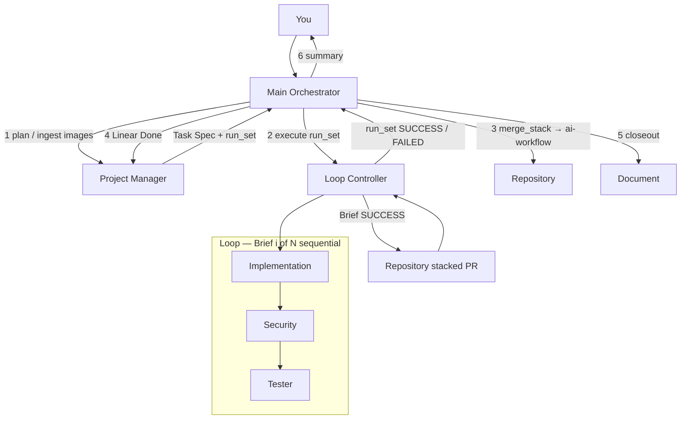
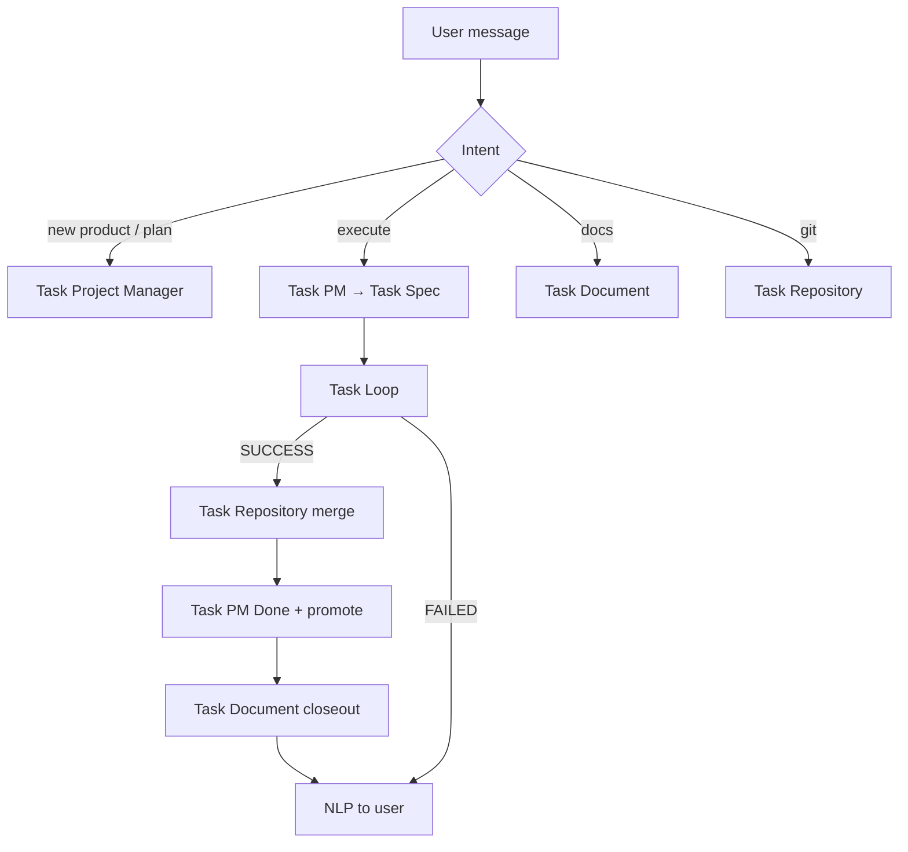
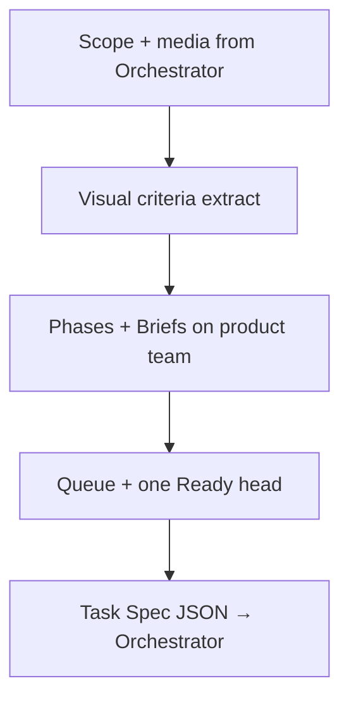
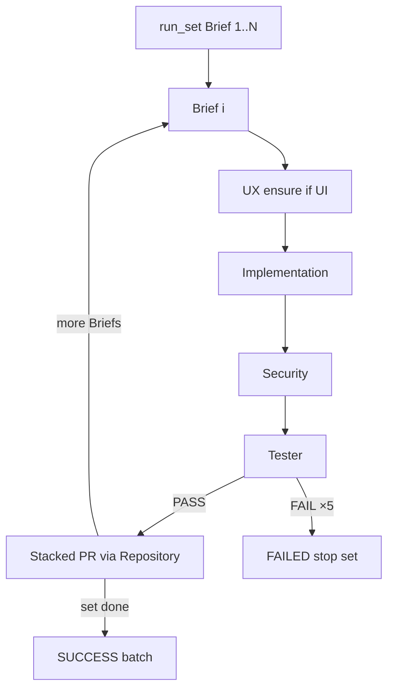
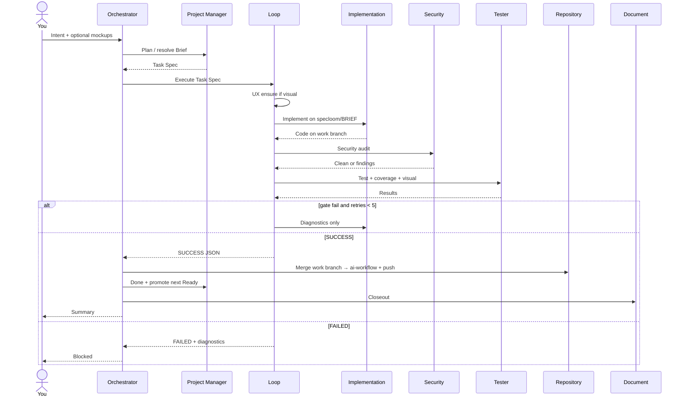
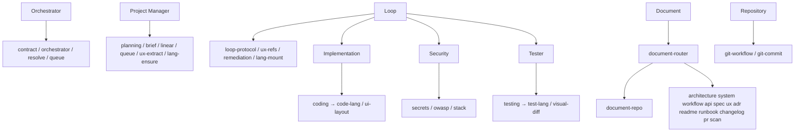

# SpecLoom v2 — Workflow

> **This is the system.** Roles = new architecture.  
> **Rules** under each role = SpecLoom behaviors that stay binding (Linear hierarchy, `ai-workflow`, queue, UX, 99% gates, docs mirror, skill injection, …).  
> Security agent = new step inside the Loop.

---

## 1. Roles

| Role | User entry? | Job |
|------|-------------|-----|
| **Main Orchestrator** | Yes (`@specloom`) | **Handoff** to agents + **NLP** to user — no domain work |
| **Project Manager** | No | All Linear; Task Spec; visual AC extract; queue |
| **Loop Controller** | No | One Brief: Implement → Security → Test; retries; confidence gate |
| **Implementation** | No | Production code (frontend / backend / database layers) |
| **Security** | No | Secrets / OWASP / stack SAST — High/Critical = fail |
| **Tester** | No | Tests, coverage, visual match vs refs |
| **Document** | No* | Docs repo mirror (bootstrap / sync / closeout) |
| **Repository** | No* | Work-branch merge → `ai-workflow`; docs push |

\*Orchestrator may expose docs/git as intents; still not parallel peer entry for planning/execution.

**Hard split**

- Orchestrator: **only** Task handoffs + NLP. Never Linear, git, code, docs content, queue resolve, or retries.  
- Loop: **never** chats with user, never marks Linear Done, never merges `ai-workflow`.  
- PM: **never** calls Loop / workers.  
- Workers: **never** Task each other — only Loop calls them.

---

## 2. Truth stores (contract)

| Store | Branch / place | Role |
|-------|----------------|------|
| **Linear** product Team | Overview → Phase → Brief | Planning SoT — **PM only writes** |
| **App git** | Work branches → merge into **`ai-workflow`** | AI integration trunk |
| **App git `main`** | Production release only | Human/release path |
| **Docs git** `<app>-docs` | **`main`** | Browseable mirror — not planning SoT |
| **specloom-standards** | topic `.md` via skills | Coding / test rules |

### App git model (stacked PRs)

```
main                      ← production only (release / human)
  ↑
ai-workflow               ← AI integration trunk (merge stack here when run_set done)
  ↑ merge_stack (bottom-up)
specloom/<brief-1>        ← Brief 1 (PR base: ai-workflow)
  ↑ stacked
specloom/<brief-2>        ← Brief 2 (PR base: specloom/<brief-1>)
  ↑ stacked
specloom/<brief-N>        ← Brief N
```

- One **run_set** may include **multiple** related Briefs (e.g. five base-UI tabs).  
- Briefs run **sequentially**: Brief *i* finishes Impl → Security → Test (gates) before Brief *i+1* starts.  
- Each Brief = own branch + [stacked PR](https://docs.github.com/en/pull-requests/how-tos/stacked-pull-requests).  
- Mid-set: push branch + open/update stacked PR — **do not** merge to `ai-workflow` until run_set complete (unless set length is 1).  
- Repository **merge_stack** → `ai-workflow` when batch SUCCESS.  
- Default planning still **one Ready head** at a time for *promotion*; a run_set is an explicit ordered batch from PM.

---

## 2b. Hardening rules (A / B / C)

### A — Coverage ≥ 0.99 with intentional ignores

Still require **coverage ≥ 0.99** on Brief production files (measured files).

**Tester** must honor language-specific **ignore directives** for defensive / unreachable / boilerplate that unit tests cannot hit:

| Stack | Allowed ignore (examples) |
|-------|---------------------------|
| Python | `# pragma: no cover` |
| JS/TS | `/* istanbul ignore next */`, c8/nyc equivalents |
| Other | Documented equivalent in `test-{lang}` |

Rules:

- Ignores only for true defensive fallbacks, framework initializers, or impossible branches — **not** to skip real AC logic.  
- Security / Implementation may flag abusive ignores.  
- Coverage tool config must respect ignore directives so reported ≥0.99 is honest.

### B — No concurrent pushes to `ai-workflow`

- **Default: single-head only** — at most one Ready / Building / Testing Brief. Enforce rigorously.  
- **Do not** run two Loops that both merge to `ai-workflow` at once.  
- If user later enables `parallel N`:
  - Each Loop uses an **isolated worktree** + `specloom/<brief-key>` branch.  
  - Loops **never** push to `ai-workflow` themselves.  
  - **Repository** serializes merge/rebase into `ai-workflow` (merge queue / lock).  
  - Push rejection → Repository retries rebase; do not corrupt trunk.

### C — Visual assets stay lean

- `document-ux` / `specloom-ux-refs` store **WebP or compressed PNG** (not raw high-res bitmaps).  
- Prefer **Git LFS** pointers for binary mockups/screenshots in the docs repo when size warrants.  
- Cap generation resolution to UI-review size (not print/4K dumps).  
- Design refs live under docs `ux/refs/**` (or LFS); never as app runtime bloat.

### D — UX / imaging (user images + generate)

| Case | Behavior |
|------|----------|
| User provides images (chat attach or paths) | **Ingest** into docs `ux/refs/` (Document + PM) — not left only in chat |
| UI / frontend Brief | **Always** `visual: true`; UX ensure **before** Implementation; Image Files never empty |
| Some refs exist, others missing | **Generate** missing screens using existing refs as **style references** (palette, type, chrome) |
| Zero refs yet | Generate first from Overview/Brief theme; later screens style-lock to that seed |

---

## 3. End-to-end workflow



---

## 4. Main Orchestrator — rules

**Two jobs only**

1. **Handoff** — intent → Task the right agent(s)  
2. **NLP** — summarize agent JSON for the user  

Orchestrator does **not** resolve Briefs, edit Linear, run git, write docs/code, or retry gates. Those are handoffs.

**Flow (handoffs)**



### Execute / run_set

- PM returns ordered **run_set** (1..N related Briefs), not always a single Brief.  
- Task Loop **once** with full `run_set`. Loop runs Briefs **sequentially** (full gates each).  
- On batch SUCCESS: Task Repository **merge_stack** → PM Done for each → Document closeout → NLP.  
- On FAILED mid-set: NLP user; do not continue the set.

---

## 5. Project Manager — rules

**Owns:** every Linear read/write for the product.

**Hierarchy (required)**

```
Product Linear Team  (not Specloom meta-team)
  └─ Overview (Project + Document)
       └─ Phase (Project + Document)
            └─ Brief (Issue KEY-n) + Queue + labels
```

**Carry-forward SpecLoom rules**

- One Team per product; `team_key` 2–5 uppercase; record name/key/id on Overview.  
- Never put app work on Specloom meta-team. Never invent a second team mid-Phase without Overview update.  
- Labels: `brief`, `frontend`, `backend`, `database`, `specloom:backlog|ready|building|testing|validating`. Prefer custom states; **else labels** — never block pipeline for missing workflow states.  
- New-product dialogue / research until **confidence ≥ 0.99** (or user-accepted holes) before bootstrap complete. Soft stall ~12; same blocker ×3 → `blocked`.  
- **UI/UX extract:** mockups → deterministic visual acceptance criteria + Image Files paths.  
- Every Brief / Task Spec must include:
  - Clear technical objective  
  - Measurable **functional** acceptance criteria  
  - Measurable **visual/layout** criteria if visual  
  - Tech stack tags + Required Context (Code + Test Standards paths)  
  - Queue block: `queue_order`, `depends_on`, `blocks`  
- Queue: lower `queue_order` earlier (scaffold → data → API → UI → polish). Topo-sort `depends_on`; fix cycles before Ready.  
- **Default: one Ready / in-flight head** — mandatory unless user explicitly says `parallel N`. Parallel is opt-in and requires Repository merge serialization (§2b B).  
- After Done (called by Orchestrator): clear stage labels → promote lowest runnable → `specloom:ready`; return `next_brief_key` — **do not** start Loop.  
- Lang stack: run **lang-ensure** so `code-*` / `test-*` exist before Task Spec claims languages.  
- **Never** invoke Loop / Implementation / Security / Tester.



---

## 6. Loop Controller — rules

**Owns:** a **run_set** of Briefs (1..N), sequential; isolates noise from Orchestrator.



**Per Brief (must finish before next)**

1. Branch: first from `ai-workflow`; later from previous Brief branch tip (stack).  
2. UI Brief → UX ensure (ingest/generate; style-lock to existing refs).  
3. Implementation → Security → Tester.  
4. Gates: confidence ≥ 0.99; ux ≥ 0.99 if visual; coverage ≥ 0.99; zero High/Critical.  
5. Retry ≤ 5; else FAILED → **stop run_set** (no Brief i+1).  
6. SUCCESS → push branch + stacked PR (do not merge_stack until set complete, unless N=1).

**UX**

- Frontend/UI Briefs **always** visual.  
- User images → already ingested to `ux/refs/` (or Loop/Document ingest first).  
- Missing screens → generate using **existing refs as style references**.

**Forbidden**

- Parallel Briefs in one run_set  
- Starting Brief i+1 before i passed gates  
- Merging to `ai-workflow` mid-set (N>1)  
- User chat / Linear Done / promote queue  

---

## 7. Implementation — rules

- Layers only: **frontend | backend | database** (no per-language peer agents).  
- Load **specloom-coding** → `code-{lang}` + listed standards CORE/topics only — **no freestyle** if skill missing (fail up for lang-ensure).  
- Never load `test-*` for prod work.  
- No placeholder TODOs — full implementation.  
- Visual tasks: **Read** every listed Image File; match hierarchy/spacing/theme/labels; big deviation → Open Question / fail owner build.  
- Fix retries: change **only** issues in the diagnostic report.  
- Commit on **`specloom/<brief-key>`** (stacked on prior Brief branch or `ai-workflow`).  
- Add coverage ignore directives only where Tester/`test-{lang}` allow (§2b A).  
- Never Task Security / Tester / Loop peers.

---

## 8. Security — rules (new)

- Secret scan (keys, tokens, credentials).  
- OWASP / injection / access control / sanitization.  
- Stack-specific security skills when mounted.  
- High or Critical → fail with file, line, remediation.  
- No “soft pass” on High/Critical.

---

## 9. Tester — rules

- Load **specloom-testing** → `test-{lang}` + Test Standards only.  
- No production feature writes; don’t load `code-*` unless listed under Test Standards.  
- Every functional AC → test/assertion.  
- **coverage ≥ 0.99** on Brief production files; missing coverage tool = fail.  
- **Honor ignore directives** (`pragma: no cover`, `istanbul ignore`, …) per `test-{lang}` — defensive/unreachable only (§2b A). Reject ignores that hide AC paths.  
- Visual: screenshot / multimodal diff vs Image Files; require **`ux_confidence ≥ 0.99`**.  
- Structured pass/fail + stack traces; tag issues `owner:build|test`.  
- Never mark Linear Done / promote queue / Task Implementation.

---

## 10. Document — rules

Universal documentation agent — **any** doc request (not only Specloom closeout).

**Owns**

- Create / ensure **docs repo** (`document-repo` skill — not app code).  
- Write / update docs by **type** (skills below).  
- SpecLoom pipeline modes still work: bootstrap tree, sync Brief, closeout.

**Carry-forward SpecLoom rules**

- Default Specloom tree when bootstrapping a product docs repo: `README.md`, `architecture/`, `system/`, `workflow/`, `ux/`, `specs/active|archived`.  
- Linear wins on planning conflict. Scan app on `ai-workflow`; unknowns `_TBD_`.  
- `ux/README.md` indexes refs (`source: generated|screenshot|designer`).  
- No app feature code; no secrets.  
- Commits on docs **`main`**; binaries via WebP/PNG/LFS (§2b C).  
- Repository may push if Orchestrator routes that way.

**Not limited to Specloom tree** — user can ask for ADRs, API refs, runbooks, PR bodies, etc.; Document mounts the matching type skill.

---

## 11. Repository — rules

- Bootstrap **app** repo: default `main`, create **`ai-workflow`** from `main`. Idempotent; `gh auth` required.  
- **Integration trunk = `ai-workflow`.** Stacked Brief branches merge here via **merge_stack**.  
- **Per Brief SUCCESS (mid run_set):** push `specloom/<brief>`; open/update [stacked PR](https://docs.github.com/en/pull-requests/how-tos/stacked-pull-requests) (`base` = `ai-workflow` or previous Brief branch).  
- **merge_stack (run_set done):** merge bottom-up into `ai-workflow` + push; close PRs.  
- Single-Brief set: PR into `ai-workflow` and merge on SUCCESS.  
- Loops never push trunk. Serialize trunk merges.  
- Docs: push docs `main` when asked; **docs create / image ingest** = Document.  
- Invent no docs content.  
- Linear Done only after **`ai-workflow` has the merged stack** (or single Brief merge).

---

## 12. Payloads

### Orchestrator → Loop

```json
{
  "run_set": ["BUD-10", "BUD-11", "BUD-12"],
  "task_id": "BUD-10",
  "project_name": "budget-tracker",
  "tech_stack": {
    "language": "typescript",
    "framework": "react-native",
    "testing_framework": "jest"
  },
  "task_spec": {
    "title": "…",
    "description": "…",
    "functional_criteria": ["…"],
    "visual_criteria": ["…"],
    "attachments": ["ux/refs/…"],
    "queue": { "queue_order": 10, "depends_on": [], "blocks": [] },
    "layers": ["frontend"],
    "standards": { "code": ["…"], "test": ["…"] }
  },
  "visual_assets": []
}
```

Loop walks `run_set` in order; `task_id` / `task_spec` may be repeated per Brief or sent as `task_specs[]` keyed by Brief.

### Loop → Orchestrator

```json
{
  "task_id": "BUD-12",
  "status": "SUCCESS",
  "confidence_score": 0.99,
  "execution_metrics": {
    "retries_attempted": 1,
    "security_vulnerabilities": 0,
    "tests_passed": 12,
    "tests_failed": 0,
    "coverage": 0.99,
    "ux_confidence": 0.99,
    "code_confidence": 0.99
  },
  "artifacts": {
    "modified_files": ["…"],
    "commit_message": "feat: …",
    "work_branch": "specloom/BUD-12",
    "base_branch": "ai-workflow"
  },
  "diagnostics_log": []
}
```

---

## 13. Sequence — one request → Done



---

## 14. Forbidden (global)

- Orchestrator coding or retrying gates  
- PM calling Loop/workers  
- Loop marking Done / promoting queue / merging to `ai-workflow` / user chat dumps  
- Peer-chaining Implementation ↔ Security ↔ Tester  
- Skipping UX ensure on visual Briefs  
- Passing visual below `ux_confidence 0.99`  
- Coverage &lt; 0.99 without valid ignore directives (§2b A)  
- Abusing coverage ignores to skip AC logic  
- Two Loops merging to `ai-workflow` concurrently (§2b B)  
- Skipping Repository merge/push to `ai-workflow` before Done  
- Specloom meta-team for product Briefs  
- Docs as planning SoT; secrets in commits  
- Freestyle languages without `code-*` / `test-*`  
- Auto-running the next Brief after Done  
- Storing raw high-res bitmaps in git when WebP/PNG/LFS required (§2b C)

---

## 15. Skills (by role)

Naming: `specloom-<area>` for framework skills; `code-*` / `test-*` stay language skills. Document type skills: `document-<type>`.

### Main Orchestrator

| Skill | Does |
|-------|------|
| `specloom-contract` | Shared law (thresholds / forbidden) — read only |
| `specloom-orchestrator` | Intent → which agent to Task; NLP reply rules |

### Project Manager

| Skill | Does |
|-------|------|
| `specloom-planning` | Features → milestones / Phases / dependency graph |
| `specloom-brief-plan` | Brief body shape (objective, AC, stack, standards) |
| `specloom-brief-bootstrap` | New-product checklist |
| `specloom-linear-team` | Product Team create/verify + labels |
| `specloom-queue` | `queue_order` / `depends_on` / one Ready head |
| `specloom-resolve-work` | Resolve Ready / named Brief on product team |
| `specloom-ui-ux-extract` | Mockups → visual AC + Image Files paths |
| `specloom-domain-research` | Research before scoping questions |
| `specloom-lang-ensure` | Ensure `code-*` / `test-*` exist for stack |
| `specloom-init-dialogue` | Greenfield Q&A to ≥0.99 confidence |
| `specloom-init-foundation` | Overview sections template |

### Loop Controller

| Skill | Does |
|-------|------|
| `specloom-loop-protocol` | Impl → Security → Test; retries ≤5; SUCCESS/FAILED JSON |
| `specloom-resolve-work` | Confirm Brief while executing |
| `specloom-queue` | Stage / head rules (read) |
| `specloom-ux-refs` | Visual ensure → `ux/refs` WebP/PNG/LFS |
| `specloom-remediation` | Map gate fails → `owner:build|test|security` |
| `specloom-lang-mount` | Inject `code-*` / `test-*` / security into workers |
| `specloom-coverage` | Coverage ≥0.99 + ignore directives |

### Implementation

| Skill | Does |
|-------|------|
| `specloom-coding` | Loader → `code-{lang}` + standards CORE/topics |
| `code-{lang}` | Language rules (react, rust, tauri, python, …) |
| `specloom-ui-layout` | Mockups / visual AC → UI structure |
| `specloom-standards-fetch` | Pin/clone specloom-standards (via coding) |

### Security

| Skill | Does |
|-------|------|
| `specloom-security-secrets` | Hardcoded keys / tokens / credentials |
| `specloom-security-owasp` | Injection, access control, sanitization, … |
| `specloom-security-stack` | Lang/framework-specific SAST rules |

### Tester

| Skill | Does |
|-------|------|
| `specloom-testing` | Loader → `test-{lang}` + Test Standards |
| `test-{lang}` | Framework tests + **coverage ignore** conventions |
| `specloom-visual-diff` | Screenshot vs Image Files → `ux_confidence` |
| `specloom-coverage` | Enforce ≥0.99 with allowed ignore directives (§2b A) |
| `specloom-standards-fetch` | Via testing loader |

### Document (universal)

Always load router + repo skill; then mount **type** skill(s) for the request.

| Skill | Does |
|-------|------|
| `document-router` | Classify request → which type skill(s); Specloom mode vs freeform |
| `document-repo` | Create/ensure docs repo + `templates/` bootstrap tree |
| `document-architecture` | System overview, app structure, deps diagrams |
| `document-system` | Runtime, integrations, env, data flow |
| `document-workflow` | How SpecLoom / team process works for this product |
| `document-api` | HTTP/RPC/event API reference |
| `document-spec` | Brief sync / active+archived specs (`sync_brief`, closeout archive) |
| `document-ux` | `ux/refs` index; WebP/PNG + LFS policy (§2b C) |
| `document-adr` | Architecture Decision Records |
| `document-readme` | Root / package README |
| `document-runbook` | Ops: deploy, incident, restore |
| `document-changelog` | Release notes / changelog entries |
| `document-pr` | PR / release description from SUCCESS payload |
| `document-scan` | Scan app (`ai-workflow`) → fill docs; `_TBD_` unknowns |

**Specloom pipeline → type skills**

| Mode | Skills |
|------|--------|
| `bootstrap` | `document-repo` + architecture + system + workflow + ux + readme |
| `sync_brief` | `document-spec` |
| `closeout` | `document-spec` + optional changelog/pr + scan refresh |
| `scan` | `document-scan` (+ types it discovers missing) |
| User “write an ADR for X” | `document-adr` |
| User “document the API” | `document-api` |
| User “create docs repo” | `document-repo` only |

### Repository

| Skill | Does |
|-------|------|
| `specloom-git-workflow` | App remotes; `ai-workflow` trunk; work-branch merge; serialize merges |
| `specloom-git-commit` | Conventional commits on work branch |
| `specloom-git-merge-trunk` | Rebase/merge `specloom/<brief>` → `ai-workflow` + push; conflict handling |
| `specloom-git-worktree` | Isolated worktrees when `parallel N` (§2b B) |

*(Docs repo **create** = Document `document-repo`. Repository pushes docs `main` when Orchestrator asks.)*

---

## 16. Skill map (diagram)



---

*Next: author missing skill stubs + rewrite agents to these eight roles.*
