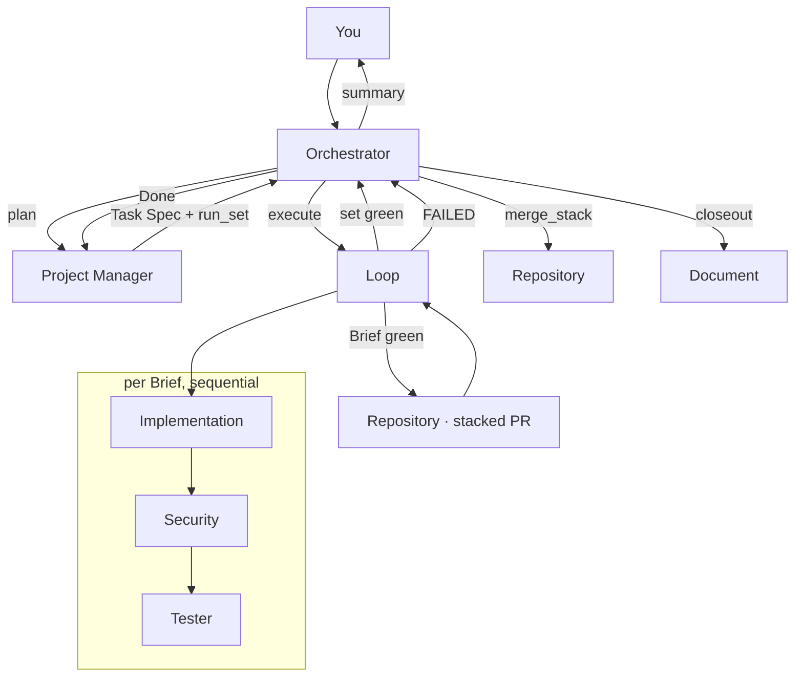

# SpecLoom v3 — Workflow

**This is the contract.** Where any other document disagrees, this wins.

---

## 1 · Roles

| Role | User entry | Job |
|------|-----------|-----|
| **Main Orchestrator** | yes — `@specloom` | handoff + natural language. No domain work |
| **Project Manager** | no | all tracker writes; Task Spec; visual criteria; queue |
| **Discovery** | no | reads the goal and everything built, researches, proposes capabilities |
| **Loop Controller** | no | one `run_set`; per-Brief gates; retries; budgets |
| **Implementation** | no | production code, frontend / backend / database |
| **Security** | no | secrets, OWASP, stack SAST on the Brief diff |
| **Tester** | no | tests, coverage ratchet, visual criteria |
| **Document** | no* | docs repo mirror, any document type |
| **Repository** | no* | stacked PRs, `merge_stack`, `revert_stack` |

\*reachable as an intent through the Orchestrator; not a peer entry for execution.

**Hard splits**

- Orchestrator: Task handoffs and replies only. Never the tracker, git, code, queue resolution or retries
- Loop: never chats, never marks Done, never merges the trunk
- PM: never Tasks the Loop or a worker
- Workers: never Task each other — only the Loop calls them

---

## 2 · Sources of truth

The tracker is chosen **once, at bootstrap** — `linear` or `github` — and recorded on the
Overview. One product, one tracker; never two at once and never a fallback when one fills up.
See **specloom-tracker**.


| Store | Where | Role |
|-------|-------|------|
| **Tracker** — `linear` or `github` | Overview → Phase → Brief | planning truth — **PM is the only writer** |
| **App git** | work branches → `ai-workflow` | AI integration trunk |
| **App git `main`** | release only | human path |
| **Docs git** `<app>-docs` | `main` | browseable mirror, never planning truth |
| **specloom-standards** | topic `.md` via skills | coding and test rules |
| **`.specloom/skills/`** | product repo | pinned `code-*` / `test-*` (v3) |

### Git model

```
main                    ← release only
  ↑
ai-workflow             ← AI integration trunk
  ↑ merge_stack (bottom-up) / revert_stack (reverse order)
specloom/<brief-1>      ← PR base: ai-workflow
  ↑ stacked
specloom/<brief-N>      ← PR base: specloom/<brief-N-1>
```

Briefs in a `run_set` run **sequentially** — Brief *i* passes all three gates before *i+1*
starts. Nothing merges to `ai-workflow` until the whole set is green, unless N = 1.

---

## 3 · Stop conditions

Every gate separates **done** from **stuck** mechanically. v2's `≥ 0.99` scores were emitted by
the same agent that did the work, after it had read the threshold — retired in v3.

| Gate | Passes when |
|------|-------------|
| **Implementation** | Validation commands exit 0 **and** zero critical/major findings |
| **Security** | zero High **and** zero Critical |
| **Tester** | suite green **and** `coverage ≥ coverage_floor` **and** zero critical/major findings |

A finding without a `file` and a resolvable `source` is **dropped** — see **specloom-findings**.

### Budgets

| Gate | Attempts |
|------|----------|
| Implementation | 3 |
| Security | 2 |
| Tester | 3 |
| Brief total | 6 |
| Spend | `token_budget_per_brief`, default 250,000 |

FAILED names the stuck gate. Three identical `(file, rule)` failures stop the gate early.

---

## 4 · End to end



On FAILED the set stops: the failed PR becomes a draft, earlier green PRs stay open and
blocked, `ai-workflow` is untouched.

---

## 5 · Per-agent rules

Each agent's own file carries a **when-to-load** table for its skills. Loading is conditional,
not a fixed list — that is what makes two runs of one Brief comparable.

| Agent | Loads always | Loads conditionally |
|-------|--------------|---------------------|
| `specloom` | contract, orchestrator | nothing else, ever |
| `discovery` | contract, discovery-scan, discovery-proposal, tracker | discovery-research, domain-research |
| `project-manager` | contract, tracker | resolve-work, queue, tracker-linear \| tracker-github, planning, brief-plan, brief-bootstrap, init-*, domain-research, ui-ux-extract, lang-ensure |
| `loop` | contract, loop-protocol, lang-mount | findings, remediation, resolve-work, queue, ux-refs, coverage |
| `implementation` | contract, findings, coding, standards-fetch | ui-layout, `code-{lang}` |
| `security` | contract, findings, security-secrets | security-owasp, security-stack |
| `tester` | contract, findings, testing, coverage, standards-fetch | visual-diff, `test-{lang}` |
| `repository` | git-workflow | git-commit, git-merge-trunk, git-worktree |
| `document` | contract, document-router | one type skill per request |

---

## 5b · Discovery

`specloom-discovery` answers what to build next. It reads the Overview, every done and open
Brief, the code and `docs/decisions/`, researches how comparable tools solve the gaps it finds,
and returns proposals.

It **proposes only**. It never writes the tracker, never creates a Brief, and carries
`disallowedTools: Agent` so it cannot delegate. Proposals are written to `docs/proposals/` by
Document; the user accepts; PM then creates Briefs from the accepted ones.

Proposals carry **no scores** — no RICE, no ICE, no impact rating. A proposal justifies itself
with sourced evidence, an observable ("what is true afterwards that is not true now, checkably"),
named unknowns, and a coarse `cost_shape`. A benefit that cannot be checked is rejected before
the user sees it.

Rejected proposals stay in the index with their reason. That record is what stops the next run
re-proposing them.

`state: no_proposals` is a valid result. An ideation agent that always finds five ideas is a
generator, not a filter.

## 6 · Coverage

`coverage_floor` defaults to **0.90** and **ratchets up**: a Brief landing above it raises it.
Measured over the Brief's production files, not the repo. Ignore directives are honoured for
unreachable code and audited — an ignore covering acceptance-criteria logic is a `major`
finding. See **specloom-coverage**.

## 7 · Visual work

A visual Brief always has Image Files, and UX ensure runs before gate 1. Each visual criterion
resolves to pass or fail against a named reference — no averaged score. Generated references
are **frozen** once reviewed, so acceptance criteria stop moving between runs. See
**specloom-visual-diff** and **specloom-ux-refs**.

## 8 · Degraded modes

| Condition | Behaviour |
|-----------|-----------|
| Tracker unavailable | resolving and planning halt; in-flight Briefs and merges proceed; Done transitions defer to `.specloom/pending-tracker.json` |
| `code-*` / `test-*` missing | Brief stops **before** gate 1, routed to `lang-ensure` |
| No coverage tool | Tester red with a `critical` finding — never estimate |
| No security profile for the stack | recorded as skipped in `checks_run`, not a silent pass |
| Merge conflict | stop, report `file:line`, trunk untouched |
| Merged stack wrong | `revert_stack`, reverse order, `-m 1` |

## 9 · Payloads

### Orchestrator → Loop

```json
{
  "run_set": ["BUD-10", "BUD-11"],
  "project_name": "budget-tracker",
  "tech_stack": { "language": "typescript", "framework": "react", "testing_framework": "jest" },
  "coverage_floor": 0.90,
  "token_budget_per_brief": 250000,
  "task_specs": { "BUD-10": { } }
}
```

### Loop → Orchestrator

```json
{
  "run_set": ["BUD-10", "BUD-11"],
  "state": "SUCCESS",
  "briefs": [
    {
      "brief": "BUD-10",
      "state": "green",
      "attempts": { "implementation": 1, "security": 1, "tester": 2 },
      "coverage": { "percent": 0.93, "floor": 0.90, "new_floor": 0.93 },
      "visual_results": [],
      "findings": [],
      "branch": "specloom/BUD-10",
      "pr": "",
      "receipt": { "files_read": 11, "files_written": 4, "tool_calls": 23, "skills_loaded": [] }
    }
  ],
  "tokens_spent": 148000
}
```

On failure: `"state": "FAILED"`, `"stuck_gate": "tester"`, `"reason": "gate_attempts" | "budget" | "lang_missing"`.

No `confidence_score`, no `code_confidence`, no `ux_confidence`. They do not exist in v3.

No `tokens_used` either. An agent cannot measure its own consumption, so it reports a
**receipt** of what it did — files, tool calls, skills loaded — and token accounting comes from
harness telemetry. `@specloom` closes every reply with the per-agent table. See
**specloom-usage**.

---

## 10 · Usage accounting

```bash
node scripts/usage-collector.mjs                 # terminal 1

export CLAUDE_CODE_ENABLE_TELEMETRY=1            # terminal 2, before launching
export OTEL_METRICS_EXPORTER=otlp
export OTEL_EXPORTER_OTLP_PROTOCOL=http/json
export OTEL_EXPORTER_OTLP_ENDPOINT=http://localhost:4318
export OTEL_METRIC_EXPORT_INTERVAL=5000
```

The collector groups `claude_code.token.usage` by `query_source` and `agent.name`, scoped to
`session.id`. `billable = input + output + cacheCreation`; `cacheRead` is displayed but excluded
from the total, since counting it would overstate spend several-fold.

If the collector is not running, `@specloom` says so and shows receipt totals instead of
inventing a number.
